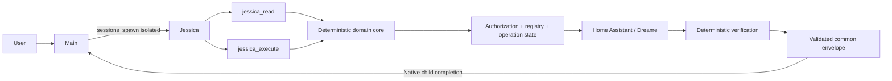

# Jessica migration plan — historical Stages 0–8

**Historical evidence, retained 2026-10-09.** The original migration plan below preserves its decisions, stage results and recovery references. Its startup instructions, proposed architecture and relative words such as “current” apply to that historical stage; they are not instructions to restart Stage 0 or restore legacy runtime paths.

Current system ownership: [Architecture](../../architecture/BENSON_SUBAGENT_ARCHITECTURE.md). Current event-driven migration/proof gates: [root Implementation Plan](../../BENSON_DECISION_ROUTING_IMPLEMENTATION_PLAN.md). Current device capabilities, physical predicates and FC work: [Full Capability Plan](FULL_CAPABILITY_PLAN.md). P01–P04 evidence and archived P05 are tracked in the root Plan. The General Workflow target is superseded; deferred conditional actions remain explicitly retained. This banner changes documentation only and claims no event-driven deployment.

Oren approved the revised Architecture. Its common admission/Response ownership and typed no-Run handling govern future work; trusted device alerts do not establish task completion or release. The root Plan separates those proof gates. Full Capability Plan §7.4 pending-start hours remain unapproved for runtime implementation; neither this historical plan nor documentation review activates them.

---

**תוכנית האב ל־Jessica: לשמר את סוכן התחום, להחליף את גבול הביצוע, ולהחזיר יכולות בהדרגה לפי ראיות.**

הבדיקה בוצעה בקריאה בלבד. לא שונו קבצים, הגדרות או שירותים; לא נוצרו checkpoints; לא הופעל `jessica-control` ולא נשלחו פקודות פיזיות לשואב.

**1. Executive summary — ההמלצה**

לשמור על המסלול הקנוני:

`User → Main → fresh isolated Jessica → deterministic capability → Home Assistant → verification → structured result → Main`

היעד המומלץ הוא:

- חוזה Jessica קצר וממוקד במקום תבנית `AGENTS.md` הכללית הנוכחית.
- שני כלי OpenClaw ייעודיים: קריאה וביצוע, עם schemas סגורים.
- מימוש תחום קנוני יחיד בתוך Benson; `/usr/local/bin` יהפוך לכל היותר למעטפת תאימות.
- הרשאה על בסיס זהות runtime מהימנה, ללא זהות או “אישור” שהמודל ממציא.
- registry יחיד לחדרים, aliases, entities וקישור למפה.
- אימות תוצאה, טיפול בהתנגשות ו־idempotency בקוד.
- שימוש באחסון plugin native של OpenClaw למצב הפעולות ההכרחי.
- החזרת יכולות בסיסיות תחילה; הרחבות רק לאחר אימות תמיכה וערך.

לא ניתן עדיין לאשר שמיפויי החדרים או פעולות המכשיר עובדים כיום: קריאות ה־GET ל־Home Assistant נכשלו בחיבור מסביבת הבדיקה. התוכנית מוכנה לביצוע בשלבים, עם שערי קבלה מפורשים עבור החוסרים האלה.

**2. Evidence and freshness — ראיות ועדכניות**

סיווגי הממצאים בהמשך הם בדיוק: `VERIFIED CURRENT FACT`,‏ `HISTORICAL FACT`,‏ `CANONICAL ARCHITECTURE`,‏ `ASSUMPTION`,‏ `UNKNOWN`.

הצעות התכנון בסעיפים 9–26 הן `ASSUMPTION` במובן של **מפרט יעד מוצע**, אלא אם סומן אחרת; הן אינן טענה שהיכולת כבר קיימת.

| סיווג | ראיה | מסקנה |
|---|---|---|
| `CANONICAL ARCHITECTURE` | [מסמך הארכיטקטורה](/home/oa/projects/benson/architecture/BENSON_SUBAGENT_ARCHITECTURE.md:524), [PLANS.md](/home/oa/projects/benson/PLANS.md) | סוכן ייעודי, isolation, ביצוע דטרמיניסטי, מעטפת משותפת, native-first |
| `VERIFIED CURRENT FACT` | [snapshot האחרון](/home/oa/projects/benson/output/context/benson-context-20260918-151652.md:1) | נוצר ב־18.9.2026,‏ 15:16:52 IDT |
| `VERIFIED CURRENT FACT` | בדיקה מקומית ב־19.9.2026, סמוך ל־11:25 IDT | הקבצים המרכזיים שנבדקו אינם בעלי `mtime` מאוחר מה־snapshot |
| `VERIFIED CURRENT FACT` | `openclaw/package.json` המותקן | גרסה מותקנת: `2026.9.4` |
| `VERIFIED CURRENT FACT` | `openclaw.json`, בחירה ממוקדת של שדות לא סודיים | הגדרות Jessica/Main, מודלים וכלים |
| `VERIFIED CURRENT FACT` | SQLite של OpenClaw, קריאה בלבד | allowlist נוכחי וראיות runtime שמורות |
| `VERIFIED CURRENT FACT` | `jessica-read rooms` | הממשק פועל ומחזיר registry סטטי |
| `VERIFIED CURRENT FACT` | `jessica-read summary`,‏ `map-status` | שתי הקריאות הסתיימו ב־exit 7 ללא תוצאת HA |
| `UNKNOWN` | אין תשובת HA חיה | מצב השואב, המפה, entities וזמינות השירותים כרגע |

ה־snapshot האחרון **חלקי**: פקודות version/models/cron נכשלו בזמן יצירתו, והוא דילג על תוכן `/usr/local/bin/jessica` בשל גודלו. לכן הוא מקור למפת קבצים, לא הוכחת תקינות runtime.

לא נמצאה ראיה לשינוי מאוחר בנתיבי Jessica שנבדקו. זו בדיקת metadata, לא הוכחת שוויון תוכן היסטורית ולא הוכחה שה־gateway החי טען את אותם קבצים. אין הצדקה לסמן עובדת מכשיר מה־snapshot כעדכנית.

לבדיקת delta בסשן הבא, אלו תחיליות SHA-256 שנמדדו:

| קובץ | תחילית hash |
|---|---|
| Jessica `AGENTS.md` | `6ebc4800302deb9b` |
| Main `AGENTS.md` | `30ccd4e4f17a96e8` |
| `/usr/local/bin/jessica` | `5890d286ed858993` |
| `/usr/local/bin/jessica-read` | `fe9b1a6cd149e3be` |
| `/usr/local/bin/jessica-control` | `9e2c5e770470cd1d` |

**3. Verified current Jessica state — המצב הנוכחי**

| סיווג | רכיב | ממצא |
|---|---|---|
| `VERIFIED CURRENT FACT` | Agent | `jessica-vacuum`; workspace ב־`agents/jessica-vacuum` |
| `VERIFIED CURRENT FACT` | מודל מוגדר | `openai/gpt-5.6-sol` |
| `VERIFIED CURRENT FACT` | מודלים נוספים | קיימות הגדרות agent עבור Terra ו־Luna; הן אינן שרשרת fallback |
| `VERIFIED CURRENT FACT` | fallback | אין fallback אפקטיבי מהגדרת Jessica: במימוש המותקן, `model` כמחרוזת מפורשת מחזיר override ריק |
| `VERIFIED CURRENT FACT` | ברירת מחדל גלובלית | Terra עם fallback ל־`ollama/gemma4:latest`; אינה מוכיחה fallback של Jessica |
| `VERIFIED CURRENT FACT` | כלים | `profile=minimal`,‏ `alsoAllow=["exec"]`,‏ `deny=["message"]` |
| `VERIFIED CURRENT FACT` | exec | `host=gateway`,‏ `mode=allowlist`,‏ `safeBins=[]`,‏ `strictInlineEval=true`,‏ elevated כבוי |
| `VERIFIED CURRENT FACT` | allowlist | `jessica-read`,‏ `jessica-control`,‏ `jesica-healthcheck`,‏ `jesica-healthreport` |
| `VERIFIED CURRENT FACT` | health executables | שני נתיבי `jesica-health*` לא נמצאו בבדיקת `/usr/local/bin` |
| `VERIFIED CURRENT FACT` | skills | `skills: []` |
| `VERIFIED CURRENT FACT` | חוזה Jessica | [AGENTS.md](/home/oa/projects/benson/agents/jessica-vacuum/AGENTS.md:1) הוא תבנית כללית, ללא חוזה vacuum וכלים מדויקים |
| `VERIFIED CURRENT FACT` | Main | [חוזה Jessica ב־Main](/home/oa/projects/benson/main/AGENTS.md:281) מגדיר בעלות תחום ואוסר bypass |
| `UNKNOWN` | הרשאות HA בפועל | היקף הרשאות החשבון שמאחורי מנגנון האימות לא נבדק; לא נקראו סודות |

`exec` הוא כלי shell כללי, אך מוגבל כאן ב־allowlist; אין להסיק מכך shell בלתי מוגבל. מנגד, הרשאת executable היא רחבה יותר מהרשאת פעולה סמנטית מסוימת.

`HISTORICAL FACT`: דוחות runtime שמורים מאשרים Sol, אפס skills, ו־`exec`. בריצת child מ־28.8 הוזרק רק `AGENTS.md`; בריצות אחרות הוזרקו גם `SOUL.md`,‏ `IDENTITY.md`,‏ `USER.md`. הדוחות דיווחו `sandbox=off`.

`VERIFIED CURRENT FACT`: קוד OpenClaw המותקן מסנן bootstrap של subagent ל־`AGENTS.md` בלבד. לכן **לא נמצאה תלות של ריצת Jessica מבודדת ב־memory/dreaming**. עצם קיום הקבצים אינו ראיה לתלות, ולא נקרא corpus הזיכרון.

**4. Historical capability reconstruction — שחזור היכולות**

מקורות ההיסטוריה המרכזיים הם תיעוד בתוך [המימוש הישן](/usr/local/bin/jessica:861), הצעות skill, וריצת child שמורה. לא נמצאו בחיפוש הממוקד מקור קנוני נוסף או חבילת tests של Jessica.

| סיווג | יכולת | רמת הראיה ההיסטורית |
|---|---|---|
| `HISTORICAL FACT` | ניקוי 13 חדרים | קוד, validation ובדיקות מצב קיימים; תיעוד פנימי מתאר ניסויים פיזיים |
| `HISTORICAL FACT` | hallway‏ 7,‏ tal_room‏ 14 | מתועדים active segment, שטח/זמן, חזרה לעגינה והיעדר שגיאה |
| `HISTORICAL FACT` | מטבח | מתועד shortcut‏ 32, עם כמה מעברי שאיבה/שטיפה ותצפית פיזית של Oren |
| `HISTORICAL FACT` | full-home | קוד start ואימות קיימים; הצעות defaults קיימות; לא נמצאה בבדיקה הוכחת E2E עצמאית מלאה |
| `HISTORICAL FACT` | resume ממוקד | קוד guards ואימות; המטבח הוחרג בחלק מהמסלול |
| `HISTORICAL FACT` | suction/mode/wetness | קוד שינוי ו־read-back; הצעות היסטוריות אינן עקביות במונחי Turbo/Max |
| `HISTORICAL FACT` | room settings ותחנה | קוד validation, execution ואימות חלקי; audit ישן מבדיל בין בדיקת state לניסוי פיזי |
| `HISTORICAL FACT` | zone/spot/goto | ממשקים וקוד קיימים; named presets ריקים |
| `HISTORICAL FACT` | המשך ניקוי לאחר סיום | הצעת 21.6 מתארת כשל של משימת LLM מתוזמנת שנעלמה לפני הביצוע |
| `HISTORICAL FACT` | skill ישן | הצעות מפנות ל־`jessica-vacuum/SKILL.md`; ההצעות עצמן הן `status: proposal` |
| `HISTORICAL FACT` | delegation כושל | child מ־28.8 ניסה פקודות גילוי רבות שנדחו, והחזיר `status:"blocked"` ללא המעטפת הקנונית |

הראיות הפיזיות לחדרים הן **תיעוד היסטורי בתוך קוד**, לא שחזור של trace מלא ולא אימות עכשווי. confidence: בינוני לגבי תוצאות העבר; גבוה לגבי קיום התיעוד והקוד.

הצעות ה־skill הרלוונטיות:

- [Deferred follow-ups](/home/oa/.openclaw/skill-workshop/proposals/jessica-vacuum-20260621-2772046909/PROPOSAL.md).
- [General cleaning defaults](/home/oa/.openclaw/skill-workshop/proposals/jessica-vacuum-20260703-b4ff638c08/PROPOSAL.md).
- [Turbo versus Max](/home/oa/.openclaw/skill-workshop/proposals/jessica-vacuum-20260703-0767da349b/PROPOSAL.md).

`UNKNOWN`: האם כל הצעה אומצה אי־פעם, מתי נעלם ה־skill המקורי, והאם היו tests או config נוספים מחוץ לתחום החיפוש. לא מוצע למחוק חומר כזה על סמך אי־מציאתו.

**5. Current capability/tool inventory — מלאי נוכחי**

בטבלה: “כן” מתייחס לקוד שנבדק; אינו מעיד על פעולה פיזית מוצלחת. לכל פעולות השינוי **הרשאת requester חסרה בגבול הנבדק**, ותמיכת המכשיר/E2E הנוכחיים הם `UNKNOWN`.

| סיווג | קבוצה | ממשק | validation | execution | verification בקוד | מכשיר חי / E2E נוכחי |
|---|---|---|---|---|---|---|
| `VERIFIED CURRENT FACT` | status/summary/map/stats/maintenance | כן | allowlist | GET | parsing, ללא מעטפת אחידה | `UNKNOWN` |
| `VERIFIED CURRENT FACT` | rooms/capabilities/audits | כן | allowlist | חלקם טקסט סטטי | אינו גילוי חי | `UNKNOWN` |
| `VERIFIED CURRENT FACT` | חדר יחיד | כן | slug ו־flag סטטי | segment או shortcut | polling, עם predicates חלשים בחלקם | `UNKNOWN` |
| `VERIFIED CURRENT FACT` | כמה חדרים | אין ממשק wrapper ייעודי | — | שירות integration מקומי מקבל רשימת segments | אין מסלול Jessica מלא שנמצא | `UNKNOWN` |
| `VERIFIED CURRENT FACT` | full-home | `start` | בדיקת arguments | POST | polling עד 240 שניות | `UNKNOWN` |
| `VERIFIED CURRENT FACT` | pause/locate | כן | arguments | POST | “command sent” בלבד | `UNKNOWN` |
| `VERIFIED CURRENT FACT` | stop/dock | כן | arguments | POST | polling קצר; dock כולל returning | `UNKNOWN` |
| `VERIFIED CURRENT FACT` | resume/resume-room | כן | מצב/יעד, guards | קוד קיים | אימות ייעודי | `UNKNOWN` |
| `VERIFIED CURRENT FACT` | suction/mode/wetness | כן | enums/ranges | POST | read-back | `UNKNOWN` |
| `VERIFIED CURRENT FACT` | room/station settings | כן | validation בכמה שכבות | POST | read-back/מצב | `UNKNOWN` |
| `VERIFIED CURRENT FACT` | station actions | כן | `--confirm` ו־guards | POST/button | חלקי, תלוי פעולה | `UNKNOWN` |
| `VERIFIED CURRENT FACT` | zone/spot/goto | כן | tokens/ranges/confirm | קוד קיים | חלקי; presets ריקים | `UNKNOWN` |
| `VERIFIED CURRENT FACT` | consumable reset | כן | allowlist/confirm | POST | קוד ייעודי | `UNKNOWN` |
| `VERIFIED CURRENT FACT` | schedule-status | כן | קריאה | מצב הגדרות זמן | אינו scheduler מלא | `UNKNOWN` |

`--confirm` הוא פרמטר שהסוכן יכול לספק, ולכן אינו הוכחת אישור אנושי.

האינטגרציה המקומית היא `dreame_vacuum v2.0.0b23`. ב־`services.yaml` קיימים multi-segment, zones, spot, goto, shortcut ו־cleaning sequence. זהו **מפרט integration מותקן**, לא הוכחת תמיכה של הדגם המחובר.

**6. Room/entity inventory — חדרים וישויות**

`VERIFIED CURRENT FACT`: זו הרשימה הסטטית הנוכחית. הקישור הפיזי וה־flags המוצגים בה הם `HISTORICAL FACT`; התאמתם למפה החיה היא `UNKNOWN`.

| slug | segment היסטורי | שם | aliases נוספים בקוד |
|---|---:|---|---|
| `kids_bathroom` | 1 | אמבטיית ילדים | `kids-bathroom`,‏ `children_bathroom`,‏ `children-bathroom` |
| `harel_room` | 2 | חדר הראל | `harel-room` |
| `west_balcony` | 3 | מרפסת מערבית | `west-balcony`;‏ `do_not_use` |
| `parents_room` | 4 | חדר הורים | `parents-room`,‏ `master_bedroom`,‏ `master-bedroom` |
| `parents_shower` | 5 | מקלחת הורים | `parents-shower`,‏ `master_shower`,‏ `master-shower` |
| `amit_room` | 6 | חדר עמית | `amit-room` |
| `hallway` | 7 | מסדרון | `corridor` |
| `living_room` | 8 | סלון | `living-room`,‏ `salon` |
| `north_balcony` | 9 | מרפסת צפונית | `north-balcony`;‏ `do_not_use` |
| `guest_bathroom` | 10 | שירותי אורחים | `guest-bathroom`,‏ `guest_toilet`,‏ `guest-toilet`,‏ `services` |
| `dining_area` | 11 | פינת אוכל | `dining-area`,‏ `dining`,‏ `dining_room`,‏ `dining-room` |
| `kitchen` | 12 | מטבח | מסלול shortcut‏ 32 |
| `home_center` | 13 | מרכז הבית | `home-center`,‏ `center` |
| `tal_room` | 14 | חדר טל | `tal-room` |
| `kitchen_sitting_area` | 16 | מטבח פינת ישיבה | `kitchen-sitting-area`,‏ `kitchen_sitting`,‏ `kitchen-sitting` |

אין להסיק מהפער במספור דבר לגבי segment‏ 15.

`VERIFIED CURRENT FACT`: הקוד פונה ל־`vacuum.jesica_jesica`,‏ `select.jesica_suction_level`,‏ `select.jesica_cleaning_mode`,‏ `number.jesica_wetness_level`, ולתבניות entities לפי מספר חדר. האיות `jesica` הוא חלק מה־entity IDs; אין “לתקן” אותו ללא discovery.

שמות עבריים קיימים בתצוגה. לא נמצא resolver דטרמיניסטי מלא ל־aliases בעברית.

**7. IMPLEMENTATION DRIFT — הפערים והבעלים לתיקון**

כל שורה מתארת `VERIFIED CURRENT FACT` מול `CANONICAL ARCHITECTURE`.

| הפער | השכבה וה־invariant שהופר | סוג | בעל התיקון |
|---|---|---|---|
| חוזה Jessica כללי | סוכן תחום חייב לדעת את ממשקיו וגבולותיו | חולשה מבנית | Jessica `AGENTS.md` |
| תוצאות טקסט ו־exit codes | כל תוצאה חייבת envelope בעל משמעות עקבית | חולשה מבנית | domain core + schema |
| אין requester authorization | שינוי פיזי חייב לעבור הרשאה דטרמיניסטית | חולשה מבנית | native adapter + policy |
| `verified` סטטי לחדרים | היעד חייב להתאים למפה הנוכחית | חולשה מבנית | registry/reconciliation |
| קוד מטבח מיוחד | workflow צריך להיות מתואר בנתונים ובאסטרטגיית ביצוע כללית | חולשה מבנית | registry + executor |
| אימות רופף | “לא בעגינה” או התקדמות כללית אינם מוכיחים ניקוי היעד | פגם במאמת | verifier |
| pause/locate ללא אימות | קבלת command אינה תוצאה פיזית | פער יכולת | verifier/result semantics |
| אין journal/lock מאוחדים | timeout ותחרות אינם מתירים command נוסף אוטומטית | חולשה מבנית | operation state machine |
| מקור פעיל רק ב־`/usr/local/bin` | מקור קנוני, deployment ובדיקות צריכים להיות מזוהים | פער ownership | Benson domain source |
| allowlist לנתיבים חסרים | הרשאות צריכות לשקף יכולות קיימות | פגם config | OpenClaw exec policy |

דוגמה קונקרטית: אחד הענפים ב־`wait_for_room_cleaning` מקבל עלייה ב־`cleaned_area` יחד עם אינדיקציה כללית שאינה דורשת התאמה לחדר המבוקש. התיקון הוא predicate מחייב־יעד, לא חריג לחדר מסוים.

**8. Unknowns and risks — מה עדיין חסר**

| סיווג | חסר | הראיה המינימלית הנדרשת |
|---|---|---|
| `UNKNOWN` | HA נגיש מהמארח וה־gateway הפעילים | GET דרך wrapper מאושר מאותה סביבת ביצוע |
| `UNKNOWN` | דגם, map ID, segments, shortcuts נוכחיים | metadata מסונן של הישות והמפה |
| `UNKNOWN` | תמיכה בכל פעולה | שירות רשום + capability של הדגם + preconditions + canary |
| `UNKNOWN` | מדיניות משפחתית | החלטת Oren לגבי requester/action classes |
| `UNKNOWN` | propagation של sender אל child | בדיקת runtime של native context, ללא טקסט זהות מהמודל |
| `UNKNOWN` | הרשאות HA מינימליות אפשריות | בדיקת מנגנון ההרשאות בלי קריאת credential |
| `UNKNOWN` | provenance מלא של מקור Jessica הישן | חיפוש ממוקד נוסף רק אם יש lead; אחרת הכרזה על adoption כמקור legacy |
| `UNKNOWN` | completion verifier native מתאים | בדיקת hook/API בגרסה המותקנת |
| `UNKNOWN` | המודל הזול והמהיר שעובר איכות | evaluation על אותה משימת Jessica |
| `UNKNOWN` | הצלחת ניקוי פיזית מלאה | task/history signals ותצפית Oren, אם זמינים |

אין לפרש כשל חיבור בסביבה הנוכחית כהוכחה ש־Home Assistant כבוי במארח הייצור.

**9. Target architecture — ארכיטקטורת היעד**



להשוות שלושה ממשקים:

| חלופה | יתרון | מגבלה | החלטה מוצעת |
|---|---|---|---|
| `exec → wrappers` | מעט שינוי ראשוני | shell syntax, חוזה CLI, context זהות חלש ותוצאות לא אחידות | תאימות זמנית בלבד |
| כלי OpenClaw ייעודיים דרך plugin native | schema, runtime context, סינון לפי agent, ללא shell למודל | adapter קטן ותחזוקת plugin | **מומלץ** |
| command/node-host native | שימושי להפעלה מפורשת או host נפרד | אינו נותן כאן יתרון מוכח למסלול השיחה | לא לבחור כרגע |

`VERIFIED CURRENT FACT`: יש ב־Benson תקדים מקומי של כלי domain ב־[benson-reminder-tool](/home/oa/projects/benson/integrations/openclaw/plugins/benson-reminder-tool/dist/index.js:1), עם `registerTool`, בדיקת `agentId` ו־schema validation. זהו דפוס לשימוש חוזר, לא סיבה להכניס Jessica לבעלות Reminder.

ה־Plugin SDK הרשמי תומך בכלים ייעודיים; אין צורך ב־MCP או framework נוסף. [OpenClaw SDK](https://docs.openclaw.ai/plugins/sdk-overview/tools-and-commands)

**10. Deterministic vs agentic responsibility matrix**

| אחריות | בעלים |
|---|---|
| משמעות הבקשה והקשר שיחתי | Main |
| בחירת תחום והקשר מינימלי | Main |
| בחירת פעולה פנימית והבנת עמימות בתחום | Jessica |
| aliases ומיפוי room/entity | קוד registry |
| schema, ranges, capability support | קוד |
| זהות והרשאה | runtime מהימן + קוד policy |
| אישור פעולה רגישה | תהליך native מאומת, אם נדרש במדיניות |
| HA calls, preconditions, settings | executor |
| timeout, retries, side-effect reconciliation | state machine |
| תחרות ו־idempotency | קוד + אחסון native |
| אימות התוצאה | verifier |
| מעטפת תוצאה ואימותה | קוד |
| תשובה למשתמש | Main |
| polling | קוד bounded; אפס לולאות polling של LLM |

אין להעביר ל־Main את רשימת segment IDs או את הלוגיקה הפנימית של Jessica.

**11. Tool/API and schema design — שני כלים וסכמות סגורות**

המלצה: שני כלים עם discriminated unions, ולא עשרות כלי HA.

הכתיב הבא הוא מפרט schema מדויק ל־v1. בכל object:‏ `additionalProperties:false`; כל שדה נדרש אלא אם סומן `?`; ללא coercion; מערכי חדרים ייחודיים; strings אינם יכולים להיות ריקים.

```ts
type ReadRequest =
  | { operation: "status" }
  | { operation: "rooms" }
  | { operation: "capabilities" }
  | { operation: "maintenance" }
  | { operation: "statistics" }
  | { operation: "room_settings"; room: string }
  | { operation: "operation_status"; operationId: string };

type ExecuteRequest =
  | {
      operation: "clean";
      target:
        | { kind: "home" }
        | { kind: "rooms"; rooms: string[] };
      settings?: {
        suction?: "quiet" | "standard" | "strong" | "turbo";
        mode?:
          | "sweeping"
          | "mopping"
          | "sweeping_and_mopping"
          | "mopping_after_sweeping";
        wetness?: number;
      };
    }
  | {
      operation: "pause" | "resume" | "stop" | "dock";
    };
```

כללים מחייבים:

- `rooms`: בין 1 למספר החדרים המאושרים במפה; כל reference עד 80 תווים.
- `wetness`: integer בלבד; הטווח נגזר מה־entity המאומת. אין להניח ש־1–32 תקף בכל API.
- `suction` הוא enum סמנטי פנימי; adapter ממפה לערך הספציפי של השירות. אין לערבב 0–3 עם 1–4.
- `resume`: משחזר רק task שמזוהה דטרמיניסטית; אין `vacuum.start` כתחליף שקט.
- multi-room הוא branch מותנה capability. אם טרם אומת, בקשה כזאת נכשלת `CAPABILITY_UNSUPPORTED`.
- אין בשדות הכלי `requesterId`,‏ `authorized`,‏ `confirmed`,‏ raw entity, service, URL, command או coordinates.
- `operationId` מתקבל רק כמזהה שהשירות יצר; lookup מחייב ownership.
- הרחבות settings/station/locate יתווספו כ־branches ספציפיים לאחר קבלה; לא כ־`name/value` חופשי.

מעטפת התוצאה:

```ts
type Result = {
  schemaVersion: "1";
  status: "success" | "clarification_required" | "failure";
  domain: "jessica-vacuum";
  operation: string | null;
  verified: boolean;
  data: ReadData | ActionData | ClarificationData;
  warnings: {
    code: string;
    message: string;
  }[];
  error: null | {
    code: string;
    stage:
      | "input" | "identity" | "authorization" | "resolution"
      | "precondition" | "dispatch" | "verification" | "integrity";
    retryable: boolean;
    retryMode: "none" | "read_only" | "reconcile";
    sideEffects: "none" | "possible" | "observed";
    message: string;
  };
  pendingContext: null | {
    version: "1";
    clarificationId: string;
    expiresAt: string;
  };
};

type ActionData = {
  operationId: string;
  rooms: string[];
  outcome:
    | "not_sent" | "accepted" | "preparing" | "started"
    | "paused" | "stopped" | "returning" | "docked"
    | "completed" | "unknown";
  dispatch: "not_attempted" | "accepted" | "rejected" | "unknown";
  observation: null | {
    observedAt: string;
    sourceUpdatedAt: string | null;
    state: string;
    activeSegments: number[] | null;
    currentSegment: number | null;
  };
  appliedSettings: {
    suction?: string;
    mode?: string;
    wetness?: number;
  };
};

type ClarificationData = {
  question: string;
  candidates: { room: string; label: string }[];
};
```

`ReadData` יהיה union נפרד לפי operation, עם `observedAt`,‏ `freshness` ושדות נדרשים מוגדרים; לא `Record<string,unknown>`.

Invariants:

- `success` של פעולה פיזית מחייב `verified:true` ותוצאה שנצפתה.
- `accepted`/`preparing` לבדם אינם הצלחת התחלת ניקוי.
- `failure` כולל `error`; הצלחה אינה כוללת `error`.
- `clarification_required` כולל `pendingContext` ו־question, ואינו משנה מכשיר.
- `completed` מותר רק עם הוכחת completion נפרדת.
- עובדות HA נמסרות כנתונים מסוננים; טקסט שמגיע מ־HA אינו הוראה.

**12. Main → Jessica contract — חוזה delegation**

Main ישלח task brief סמנטי:

```json
{
  "request": "<verbatim current user text>",
  "goal": "<short semantic goal>",
  "relevantContext": [
    {"kind": "quoted_turn", "text": "<only necessary context>"}
  ],
  "constraints": [],
  "pendingContext": null
}
```

לא ייכללו בו claims מהמודל לגבי הרשאה, map ID, service או הצלחה.

ההפעלה:

- `sessions_spawn`:‏ `agentId="jessica-vacuum"`,‏ `context="isolated"`.
- המתנה ב־`sessions_yield`.
- completion נשאר native ומתואם ל־child ולבקשת המשתמש הנוכחית.
- בקשת status חדשה מחייבת בדיקה חדשה; אין תשובה מ־completion קודם.
- בשאלת המשך, Main מעביר רק את ההקשר הדרוש ואת `pendingContext` המדויק.
- אין שימוש ב־session ישן של Jessica להמשך.
- completion פגום אינו סיבה להפעיל שוב פעולה. אפשר recovery חד־פעמי מהיסטוריית ה־child המתואם, לפי הדפוס native הקיים ב־Main.

לזהות יש ערוץ נפרד: runtime context המועבר ל־adapter, לא תוכן ה־brief.

**13. Jessica → deterministic execution contract**

סדר הביצוע מחייב:

1. validate schema.
2. אימות `agentId`, מקור ההפעלה ו־runtime identity.
3. authorization לפי policy version.
4. resolution דטרמיניסטי של references.
5. קריאת מצב ומפה; אימות freshness ו־capability.
6. בדיקת duplicate/conflict בתוך פעולה אטומית.
7. כתיבת intent durable לפני POST.
8. החלת settings מאושרים, אם התבקשו, ואימות כל אחד.
9. dispatch יחיד.
10. רישום acceptance או uncertainty.
11. polling bounded ואימות המצב המתאים.
12. שמירת envelope מאומת והחזרתו.

אם setting ראשון השתנה והשני נכשל, אין להסתיר את השינוי ואין להמשיך לניקוי. התוצאה מפרטת `appliedSettings` ו־side effects. החזרה להגדרה קודמת היא compensation נפרד, רק אם בטוח ואין שינוי מתחרה.

Jessica מחזירה את עובדות הכלי ללא שינוי. validator של מעטפת ה־child חייב להשוות אותן לתוצאת הכלי המתואמת דרך API native; אין להסתפק בכך שה־JSON תקין תחבירית.

אם אין hook/API native מתאים בגרסה המותקנת, זהו שער החלטה לפני פריסה. אין להוסיף custom completion router או קובצי handoff.

**14. Verification/retry/idempotency/concurrency**

ה־timeouts הבאים הם **תקציבי v1 מוצעים**, לכיול ב־canaries. הם אינם התחייבות ביצוע של המכשיר.

| פעולה | preconditions | observable נדרש | timeout מוצע | גבול ההוכחה |
|---|---|---|---:|---|
| clean room(s) | מפה תקפה, idle מתאים, ללא שגיאה/conflict | task/segment target מתאים + פעילות ניקוי fresh; אין targets סותרים | 240s | התחלה, לא ניקיון פיזי מלא |
| full-home | idle מתאים; אין resumable task עמום | task כללי חדש ופעילות ניקוי; לא רק `docked=false` | 240s | התחלת ניקוי כללי |
| pause | task פעיל שניתן להשהות | paused מפורש ושימור זיהוי task | 15s | השהיית task המדווח |
| resume | task paused מזוהה ויעד שמור | חזרה לפעילות של אותו task | 240s | המשך אותו task |
| stop | task בר־עצירה | מצב stopped/idle תואם וללא flags פעילים; לא unavailable | 15s | הפסקת task, לא עגינה |
| dock | תמיכה ומצב חוקי | `returning` או `docked`, מפורטים בנפרד | 30s להתחלה | חזרה התחילה; לא “הגיעה” |
| setting | entity זמין, value מותר, מצב מתאים | read-back של הערך המדויק | 15s לשדה | configuration state |
| station | station ready, capability והרשאה | washing/drying/emptying ספציפי | 60s | הפעולה הספציפית התחילה |
| locate, אם יוחזר | תמיכה והרשאה | telemetry/event ייעודי אם קיים | 10s | ללא אות כזה: acceptance בלבד |
| completion | task correlation רציף או history מהימן | אותו task הסתיים ללא failure/cancel | נפרד | גם זה אינו מוכיח שכל הלכלוך הוסר |

לא די ב־HTTP 200. גם Home Assistant מתאר את vacuum כשכבת entities/actions שתמיכתה תלויה באינטגרציה. [Home Assistant Vacuum](https://www.home-assistant.io/integrations/vacuum/)

כללי failure:

- timeout אחרי POST:‏ `sideEffects:"possible"` או `"observed"`; אין resend.
- HTTP failure מפורש אינו שולל side effect אם החיבור נשבר לאחר שליחה.
- HA unavailable/missing fields: אין default של `false` שמאפשר “verified”.
- robot error, target mismatch או map change: כשל מסווג.
- cancellation של tool אינה ביטול תנועת השואב.

**Idempotency:** מזהה פנימי נבנה מ־trusted external request epoch, זהות requester, device והפעולה המנורמלת. אין להשתמש ב־hash הטקסט בלבד או במזהה שהמודל בוחר. שתי בקשות משתמש נפרדות באותו נוסח הן שתי בקשות; retry של אותה בקשה הוא אותה פעולה.

**אחסון:** `createPluginStateSyncKeyedStore` המותקן מספק `registerIfAbsent` ו־`update`. להשתמש בו למידע שאינו מיוצג כבר ב־OpenClaw: intent, dispatch phase, outcome ו־device conflict state. אין DB נוסף או scheduler מקביל. אטומיות ושחזור אחרי crash הם תנאי קבלה, לא הנחה.

**תחרות:**

| מצב | התנהגות |
|---|---|
| clean בזמן cleaning | `CONFLICT_ACTIVE_TASK`; אין stop אוטומטי |
| clean בזמן returning/preparing | conflict; אין המתנה ואז dispatch סמוי |
| pause ללא task | no-op מאומת או precondition failure, לפי מצב מוגדר |
| resume ללא task חד־משמעי | `NO_RESUMABLE_TASK` |
| שינוי mode בזמן ניקוי | לדחות ב־v1 |
| שני משתמשים במקביל | serialize לפי device; השני רואה מצב מעודכן |
| timeout ואז command חדש | reconciliation קודם; שינוי חוסם עד הכרעה |
| stop בזמן uncertainty | מסלול interruption מפורש, מורשה, אחרי בדיקת מצב; לא עקיפת lock שקטה |

לא ניתן להבטיח exactly-once פיזי אם ה־API אינו תומך בכך. היעד הוא מניעת resend אוטומטי ותיעוד uncertainty, במחיר חסימה בטוחה במקרה הצורך.

**15. Authorization/security**

`UNKNOWN`: אין מדיניות מוכחת המגדירה מי מבני המשפחה רשאי לבצע אילו פעולות. אין להמציא אותה.

המפרט המוצע:

- policy יחיד עם `subject`,‏ `actionClass`,‏ `deviceScope`,‏ `decision`,‏ `version`.
- default deny עבור identity/policy חסרים.
- identity מתקבלת מה־Plugin SDK, כגון `requesterSenderId` ו־`senderIsOwner`; עצם קיום השדות ב־types אינו מוכיח שהם עוברים ב־spawn.
- direct/group נבדקים בנפרד; group destination אינו sender.
- confirmation לפעולה רגישה קשור ל־requester, פעולה מדויקת, map version ותוקף; אין boolean מהמודל.
- כלי Jessica נרשמים רק ל־`agentId=jessica-vacuum`.
- להסיר מ־Jessica את `exec` לאחר המעבר; להשאיר אפס skills, ללא messaging, file write, raw HTTP או כלים של תחומים אחרים.
- credentials נשארים ב־adapter בלבד; לא ב־tool args, logs או snapshots.
- endpoints ו־entities מגיעים מ־registry, לא מהמודל.
- לא לטעון ל־OS isolation: plugin מקומי רץ בתהליך מהימן. אם נדרשת הפרדה גם מול קוד plugin שנפרץ, נדרש תכנון process/user isolation נפרד.

יש לשמר את חסימת המרפסות עד החלטה מפורשת וראיות, ולא להסיר אותה במסגרת migration.

**16. Observability**

לכל פעולה יירשמו:

`requestEpoch → parent session → child session/run → model → tool call → operationId → HA dispatch → verification → envelope → Main response`

שדות owner-only:

- requester פנימי ומקור הזהות.
- פעולה, חדרים שנפתרו, map/registry/policy versions.
- מודל בפועל ו־fallback אם היה.
- validation/authorization outcomes.
- מצב לפני, dispatch phase, ראיות אחרי.
- latency לכל שלב, retries לקריאה, reconciliation.
- error code ו־side effects.
- token usage אם runtime מספק.

למשפחה מוחזר רק המידע הדרוש לתשובה. לא מספרי טלפון, session IDs, paths, credentials או diagnostic dumps.

ה־native transcripts/run history נשארים בעלי trace השיחה. plugin state מחזיק רק את המידע המינימלי להתאוששות ולמניעת כפילות. retention מוגבל; פעולות unresolved אינן נמחקות אוטומטית.

**17. Runtime model/token/latency strategy**

`VERIFIED CURRENT FACT`: Jessica מוגדרת ל־Sol, ללא fallback אפקטיבי; לא בוצע benchmark בסשן זה.

**המלצה מותנית:** לבדוק תחילה `openai/gpt-5.6-luna` ב־low reasoning עבור בחירת פעולה, הבהרת חדרים ושימור envelope. להשוות מול Sol הנוכחי; Terra הוא מועמד נוסף אם Luna אינו עומד באיכות.

מחירי API ציבוריים שנבדקו: Luna‏ `$0.20/$1.20` ו־Terra‏ `$2/$12` למיליון input/output tokens בהתאמה. אלה אינם הוכחת latency או העלות בפועל בחשבון Benson. [Luna](https://developers.openai.com/api/docs/models/gpt-5.6-luna), [Terra](https://developers.openai.com/api/docs/models/gpt-5.6-terra)

תנאי בחירת מודל:

- אפס טעויות authorization, יעד ו־false success במערך safety.
- כל עמימות צפויה הופכת להבהרה.
- שמירת עובדות verification ללא שינוי.
- השוואת p50/p95 ועלות **לבקשה שהושלמה נכון**, כולל retries.
- ללא fallback אוטומטי בלתי נבדק. אם מאושר fallback, לקבע אותו במפורש ולבדוק replay אחרי side effects.

אופטימיזציות:

- AGENTS קצר; אין memory/dreaming injection.
- שני tools עם schemas קומפקטיים.
- אין קריאת `capability-audit` ענק בכל בקשה.
- preflight ואימות בתוך call דטרמיניסטי אחד.
- capability metadata ניתן ל־cache עם invalidation; מצב פיזי נבדק טרי.
- אין model turns בזמן polling.

**האם כל בקשה זקוקה ל־Jessica LLM?** מבחינה טכנית status או פעולה שכבר נפתרה יכולים לעבור ישירות לכלי. אבל המסלול משנה בעלות: Main יצטרך לבחור operation/room contract, או שיידרש router נוסף. הוא עשוי לחסוך inference, אך מגדיל את לוגיקת Main ומפצל את מסלול observability.

לכן baseline נשאר עם Jessica. אימוץ bypass הוא `OPERATOR DECISION REQUIRED`, עם השוואת latency אמפירית ועם אותם authorization/verifier בדיוק.

**18. Capability retention/expansion — מה להחזיר**

לכל השורות: ראיות device/API חיות הן `UNKNOWN`; תמיכת integration מקומית בלבד אינה מספיקה.

| יכולת | ראיות היסטוריה/מימוש | ערך ושיטת אימות | בעלים וסיכון | המלצה |
|---|---|---|---|---|
| status, battery, active task | GET וקוד סיכום | גבוה; מצב טרי מסונן | reader; נמוך | retain/repair |
| current room | current_segment בקוד | מועיל רק כשזמין; בלי inference | registry/reader | retain nullable |
| חדר יחיד | קוד ותיעוד פיזי | גבוה; target + activity | executor; תנועה | repair תחילה |
| כמה חדרים | integration מקבל רשימה; אין wrapper מלא | גבוה; exact requested set | executor; יעד/סדר | investigate ואז extend |
| full-home | start/verifier והצעות defaults | גבוה; task כללי מאומת | executor; היקף רחב | repair |
| pause/resume/stop/dock | קוד; אימות לא אחיד | גבוה; task state ספציפי | state machine | repair |
| locate | POST ללא אימות | בינוני; receipt/event | executor; רעש | defer או acceptance-only מפורש |
| suction/mode/wetness | קוד + read-back | גבוה; אפשרויות חיות | settings adapter | retain לאחר reconciliation |
| room settings | קוד; זמינות היסטורית מוגבלת | בינוני; read-back | settings adapter | שלב הרחבה |
| ordered cleaning | שירות integration וקוד guarded | מותנה צורך; סדר task/history | executor | defer |
| kitchen shortcut | תיעוד multi-pass | שימושי אך שונה מחדר רגיל | workflow declarative | preserve evidence, repair semantics |
| zone/spot/goto | קוד; presets ריקים | לא הוכח צורך נוכחי | map-bound presets; סיכון תנועה | defer; ללא coordinates חופשיים |
| auto-empty/wash/drying | קוד guards ומצב | ערך תחזוקה; state ייעודי | station adapter | הרחבה מורשית |
| station repair/draining/map edits | קוד מתקדם, חלקו ללא אות אמין | ערך לא הוכח | סיכון גבוה יותר | להסיר מחשיפת runtime |
| statistics/maintenance/consumables read | GET וקוד | גבוה, סיכון נמוך | reader | retain |
| reset consumables | קוד confirmed | רק לאחר החלפה אמיתית | policy + adapter | defer |
| schedules | הצעות וכשל עבר | תלוי צורך | scheduler owner | החלטה נפרדת |
| capability introspection | קטלוגים סטטיים | חשוב למניעת unsupported | reader + discovery | replace with evidence-backed catalog |
| unknown/ambiguous room | אין resolver מלא | חיוני | registry + Jessica clarification | add |

אין לשחזר defaults של Turbo/wetness‏ 16 מהצעות בלבד. עד אישור defaults, לשמר הגדרות קיימות או לבקש הבהרה כשמשמעות הבקשה תלויה בהן.

**19. Canonical ownership — בעלות וקבצים**

`VERIFIED CURRENT FACT`: שלושת executables הם קבצים רגילים, לא symlinks. לא נמצא source נוסף בנתיבי Benson והנתיבים הממוקדים שנבדקו.

לכן:

- `/usr/local/bin/jessica`: מימוש פעיל והעותק היחיד שאותר; provenance/deployment owner אינם מוכחים.
- `jessica-read` ו־`jessica-control`: wrappers פעילים סביבו; לא נמצאה ראיה שהם generated artifacts.
- אין להכריז עליהם כעותקים כפולים רק משום שהם ב־`/usr/local/bin`.

הבעלות המוצעת:

| נתיב | אחריות |
|---|---|
| `agents/jessica-vacuum/AGENTS.md` | חוזה reasoning/tools/result |
| `agents/jessica-vacuum/lib/` | schemas, registry, policy, HA adapter, state machine, verifier |
| `agents/jessica-vacuum/config/` | registry ו־policy לא סודיים |
| `agents/jessica-vacuum/tests/` | חוזים, failure injection ו־acceptance assertions |
| `integrations/openclaw/plugins/benson-jessica-tool/` | adapter native דק בלבד |
| `main/AGENTS.md` | delegation ושימור אמת בתשובה |
| `~/.openclaw/openclaw.json` | חשיפת tools/models/plugin |
| OpenClaw plugin state | מצב durable מינימלי של פעולות |
| `maintenance/bensonsnap` | snapshot, כולל כיסוי המקור החדש |

אלו נתיבי יעד מוצעים. לא ליצור שכבת domain כפולה בתוך plugin ובתיקיית agent. לא נדרש מסמך ארכיטקטורה מקביל: הרחבה קנונית אחת מספיקה אם ההחלטות מחייבות תיעוד.

**20. Keep / Repair / Replace / Remove**

| רכיב | החלטה | סיבה |
|---|---|---|
| Jessica agent וזהותו | `KEEP` | תואם גבול תחום קנוני |
| Jessica `AGENTS.md` | `REPLACE` | תבנית כללית ללא חוזה רלוונטי |
| `skills:[]` | `KEEP` | אין הצדקה ל־runtime skill |
| memory/dreaming כתלות | `REMOVE` מהחוזה | אין תלות נחוצה מוכחת; לא למחוק corpus |
| `/usr/local/bin/jessica` | `REPLACE` בהדרגה | מונולית, ownership חסר, verifier ו־state חלשים |
| `jessica-read` | `REPAIR`, ואז compatibility בלבד | לשמר CLI אם יש caller אמיתי |
| `jessica-control` | `REPLACE` כגבול runtime | CLI validation אינו authorization |
| room mappings | `REPAIR` | מקור יחיד, provenance ו־map binding |
| Main delegation | `REPAIR` | explicit isolation, freshness ו־result integrity ל־Jessica |
| tool policy | `REPLACE` לייעודי | להסיר exec לאחר acceptance |
| model configuration | `UNKNOWN / INVESTIGATE` | benchmark לפני החלפה |
| health allowlist חסר | `REMOVE` אחרי בדיקת references | הרשאות לנתיבים שאינם קיימים |
| old skill/proposals | `KEEP` כארכיון ראיות | אינם runtime policy |
| raw coordinates/map edits | `REMOVE` מחשיפת הסוכן | חסר safety contract מאומת |
| obsolete docs/config/data | `UNKNOWN / INVESTIGATE` | מחיקה רק אחרי מפת references והוכחת החלפה |

**21. Ordered implementation stages — שלבים לביצוע עתידי**

כל שלב נעצר אם תנאי הקבלה שלו נכשל. לא מבצעים אף שלב עכשיו.

**Stage 0 — השלמת ראיות חיות והחלטות**

- **Objective:** לסגור את החוסרים החוסמים בלי שינוי מכשיר.
- **Why:** אין כיום הוכחת API/device או policy.
- **Canonical owner:** Jessica domain וה־OpenClaw runtime.
- **Files/components:** ה־paths המאומתים לעיל, HA read surfaces.
- **Exact responsibility change:** אין; איסוף evidence בלבד.
- **State-changing:** לא.
- **Checkpoint required / scope:** לא / אין.
- **Implementation details:** בדיקת hashes, GET מסונן למצב/מפה/options; בדיקת requester propagation ו־native result-validation hook; הכרעת policy/defaults.
- **Validation:** כל capability מקבל provenance, זמן ורמת תמיכה; אין POST.
- **Expected result:** מטריצת support עדכנית והחלטות מתועדות.
- **Rollback:** לא נדרש.
- **Acceptance criterion:** כל blocker ל־v1 נפתר או היכולת הוצאה במפורש מ־v1.
- **Dependencies:** אין.

**Stage 1 — checkpoint ואימוץ source קנוני**

- **Objective:** ליצור בסיס שחזור ומקור יחיד בר־תחזוקה.
- **Why:** הקוד הפעיל נמצא ב־`/usr/local/bin` בלבד בחיפוש הנוכחי.
- **Canonical owner:** Benson engineering.
- **Files/components:** executables, Jessica/Main contracts, config policy, deploy metadata.
- **Exact responsibility change:** source עובר לבעלות Benson; אין שינוי התנהגות ייצור בשלב זה.
- **State-changing:** כן, קבצים בלבד.
- **Checkpoint required:** כן.
- **Checkpoint scope:** תיקייה מחוץ לעצים הפעילים, למשל `/home/oa/checkpoints/benson-jessica-<timestamp>`; hashes, modes, source/config projections ומצב plugin רלוונטי.
- **Implementation details:** שימור legacy ללא סודות; לא להניח Git תקין—בדיקת Git כאן לא הצליחה.
- **Validation:** manifest מלא ושחזור לתיקיית בדיקה נפרדת; השוואת hashes.
- **Expected result:** rollback בר־ביצוע.
- **Rollback:** הסרת source החדש בלבד; production טרם הוחלף.
- **Acceptance criterion:** restore rehearsal עבר.
- **Dependencies:** Stage 0.

**Stage 2 — schemas, registry ו־domain core**

- **Objective:** לבנות את הגבול הדטרמיניסטי ללא חיבור write לייצור.
- **Why:** validation, aliases ו־truth צריכים owner אחד.
- **Canonical owner:** `agents/jessica-vacuum/lib` ו־`config`.
- **Files/components:** schemas, registry, policy loader, result types, tests.
- **Exact responsibility change:** החלפת case lists וטקסט סטטי בחוזים מאומתים.
- **State-changing:** כן, source/config; לא מכשיר.
- **Checkpoint required / scope:** כן / source ו־config הנוגעים לשלב.
- **Implementation details:** map fingerprint, workflow declarative, ambiguity, policy default-deny; fixtures מסוננים מ־Stage 0.
- **Validation:** duplicate aliases, stale map, invalid params, unsupported capability, false-success predicates.
- **Expected result:** resolver ו־schemas נכשלים סגור.
- **Rollback:** שחזור source/config; עדיין אין שינוי runtime.
- **Acceptance criterion:** אין מסלול שעוקף validation/registry.
- **Dependencies:** Stage 1.

**Stage 3 — native adapter, זהות וכלי קריאה**

- **Objective:** להוכיח מסלול native צר עם context מהימן.
- **Why:** wrapper CLI אינו גבול זהות.
- **Canonical owner:** `benson-jessica-tool`, בשימוש domain core.
- **Files/components:** manifest/adapter, OpenClaw plugin config, tool policy.
- **Exact responsibility change:** קריאות Jessica עוברות לכלי typed ללא shell.
- **State-changing:** כן, קבצים/config/runtime load; לא מכשיר.
- **Checkpoint required / scope:** כן / config, plugin versions, policy.
- **Implementation details:** רישום לפי agent; tool context מחוץ ל־args; fail closed אם sender חסר; write tool אינו מופעל עדיין.
- **Validation:** schema, exposure denial ל־Main/agent אחר, identity spoofing, read-only production status דרך Oren.
- **Expected result:** read E2E עם envelope תקין.
- **Rollback:** ביטול plugin/config delta והחזרת policy מה־checkpoint.
- **Acceptance criterion:** status חי דרך Main→Jessica ומינימום tools בפועל.
- **Dependencies:** Stage 2; native context gate עבר.

**Stage 4 — execution, verification ומצב פעולות**

- **Objective:** לממש writes עם reconciliation ותחרות בטוחה.
- **Why:** אין כיום durable intent ו־conflict model מאוחד.
- **Canonical owner:** domain core; native plugin state.
- **Files/components:** executor, verifier, state machine, authorization, tests.
- **Exact responsibility change:** כל mutation עובר preconditions→intent→dispatch→verification.
- **State-changing:** כן, source ומצב בדיקה מבודד; לא מכשיר ייצור.
- **Checkpoint required / scope:** כן / קוד, schema version ו־plugin state של סביבת הבדיקה.
- **Implementation details:** serialize לפי device, idempotency לפי epoch, bounded polling, crash recovery; בלי retries של POST.
- **Validation:** HA fake server, crash לפני/אחרי dispatch, duplicate tool calls, שני processes, timeout, null attributes, target mismatch.
- **Expected result:** אין duplicate dispatch בנתיבי recovery שנבדקו.
- **Rollback:** קוד/schema; לא למחוק intent unresolved.
- **Acceptance criterion:** כל uncertainty נשמר ומונע resend.
- **Dependencies:** Stage 3.

**Stage 5 — חוזי סוכנים, result integrity ומודל**

- **Objective:** להשלים את המסלול השיחתי.
- **Why:** ה־child ההיסטורי נכשל בגילוי כלים ובמבנה תוצאה.
- **Canonical owner:** Jessica/Main contracts וה־native adapter.
- **Files/components:** שני `AGENTS.md`, model/tool config, completion validation.
- **Exact responsibility change:** reasoning סמנטי בלבד; תוצאת child נבדקת מול ראיות הכלי.
- **State-changing:** כן, קבצים/config; לא פעולה פיזית במסגרת evaluation.
- **Checkpoint required / scope:** כן / contracts, config, adapter.
- **Implementation details:** isolated spawn, zero skills, הסרת exec; eval של Luna/Sol/Terra ו־fallback אם מוצע.
- **Validation:** unknown/ambiguous room, follow-up, injection, malformed completion, stale completion, fallback after tool execution.
- **Expected result:** תשובות Main משמרות אמת ועמימות.
- **Rollback:** חוזים ומודל נפרדים; לא להחזיר write exposure רחב אוטומטית.
- **Acceptance criterion:** safety tests ללא false success; read-only E2E עבר.
- **Dependencies:** Stage 4.

**Stage 6 — production canaries בסיסיים**

- **Objective:** להוכיח שימוש אמיתי במכשיר.
- **Why:** mocks אינם הוכחת תמיכת device.
- **Canonical owner:** Oren לאינטראקציה; deterministic acceptance checker לראיות.
- **Files/components:** acceptance fixtures/results; registry verification metadata.
- **Exact responsibility change:** הפעלת write capabilities שעברו קבלה בלבד.
- **State-changing:** כן, מכשיר ונתוני acceptance.
- **Checkpoint required / scope:** כן / config, registry, policy ו־operation state לפני rollout.
- **Implementation details:** Oren שולח את הבקשות דרך production; canary חדר אחד, controls, full-home ו־multi-room רק לפי תמיכה.
- **Validation:** המטריצה בסעיף 22; תצפית פיזית כשנדרשת.
- **Expected result:** verified capability set מצומצם.
- **Rollback:** כיבוי writes; בדיקת מצב פיזי, stop/dock רק לפי צורך ואישור הבדיקה. שחזור קבצים אינו מבטל ניקוי.
- **Acceptance criterion:** מסלול מלא וכל claims תואמים לראיות.
- **Dependencies:** Stage 5 והחלטות policy.

**Stage 7 — הרחבות מוצדקות בלבד**

- **Objective:** להחזיר settings/station/presets בעלי ערך.
- **Why:** אין הצדקה לחשוף את כל המונולית.
- **Canonical owner:** אותו domain core, ללא מנגנון מקביל.
- **Files/components:** branches נוספים ב־schema, capabilities, registry ו־tests.
- **Exact responsibility change:** הרחבת allowlist סמנטי לאחר הוכחה.
- **State-changing:** כן; canaries פיזיים לכל הרחבה.
- **Checkpoint required / scope:** כן / כל extension ו־config/device settings הרלוונטיים.
- **Implementation details:** extension אחד בכל פעם; coordinates רק presets קשורי־מפה; scheduling מחוץ לשלב בלי החלטה נפרדת.
- **Validation:** authorization, unsupported, stale map, state verification ו־E2E ייעודי.
- **Expected result:** יכולת מועילה נוספת ללא הרחבת הרשאות כללית.
- **Rollback:** ביטול branch והחזרת config; compensation מתועד אם setting כבר השתנה.
- **Acceptance criterion:** כל capability עומד בפני עצמו בדרישות.
- **Dependencies:** Stage 6; אישור היקף ההרחבה.

**Stage 8 — migration סופי, cleanup ו־snapshot**

- **Objective:** להשאיר owner אחד ולתעד מצב מאומת.
- **Why:** תאימות זמנית אינה יכולה להפוך למימוש מקביל קבוע.
- **Canonical owner:** Benson engineering ו־`maintenance/bensonsnap`.
- **Files/components:** legacy executables, allowlists, references, snapshot coverage.
- **Exact responsibility change:** הסרת נתיבי legacy פעילים לאחר מעבר כל caller.
- **State-changing:** כן, deployment/config/files.
- **Checkpoint required / scope:** כן / העותק recoverable האחרון וה־caller map.
- **Implementation details:** wrappers דקים רק אם נדרשים; archive לחומר היסטורי; אין מחיקת memory גורפת.
- **Validation:** focused reference search, runtime exposure, canary מושפע, snapshot coverage.
- **Expected result:** אין duplicate implementation ואין הרשאות יתומות.
- **Rollback:** checkpoint תואם; reconciliation לפני החזרת writes.
- **Acceptance criterion:** E2E ירוק, cleanup מוכח ו־snapshot חדש תקין.
- **Dependencies:** Stage 6 וכל הרחבה שנבחרה מ־Stage 7.

**22. E2E acceptance matrix**

כל בדיקה פיזית תתבצע בעתיד בהסכמה במסגרת rollout. Oren מפעיל את ממשק הייצור; הקוד אוסף ומשווה ראיות.

| תרחיש | תוצאה נראית צפויה | assertion דטרמיניסטי |
|---|---|---|
| חדר מאומת אחד | “התחילה לנקות …” רק לאחר אימות | יעד נכון, task activity, dispatch יחיד |
| כמה חדרים | כל היעדים נשמרים; unsupported אם לא נתמך | request set תואם ל־task; אין חדר נוסף |
| full-home | התחלה מאומתת, בלי defaults מומצאים | general task; settings מדווחים |
| pause/resume | השהיה/המשך של אותו task | correlation נשמר |
| stop/dock | “נעצרה” או “חוזרת” בהתאם למצב | אין ערבוב returning עם docked |
| status | מצב טרי | GET חדש, ללא POST |
| חדר לא מוכר | הבהרה | אפס dispatch |
| alias עמום | שאלה עם מועמדים | אין בחירה שרירותית |
| mapping מיושן | חסימה/בקשת רענון | map mismatch לפני POST |
| parameter לא תקין | כשל input | אפס HA mutation |
| requester/action לא מורשים | סירוב קצר | authorization deny, אפס POST |
| group ללא sender מהימן | fail closed | אין שימוש ב־group ID כמשתמש |
| HA unavailable | אי־אפשר לאמת/לבצע | שגיאה מסווגת; אין הצלחה |
| vacuum unavailable | אותה אמת | unavailable אינו מצב stopped |
| service accepted ללא transition | אין claim של התחלה | verification timeout |
| timeout עם side effect אפשרי | מצוין שהמצב לא הוכרע | intent נשמר; אין resend |
| retry לאחר uncertainty | reconciliation | לכל היותר dispatch המקורי |
| שני משתמשים מתחרים | conflict ברור לשני | serialization בין runs/processes |
| “גם שם” לאחר הבהרה | יעד מהקשר הרלוונטי בלבד | pending bound לאותו requester |
| completion מובנה | Main מציג עובדות נכונות | schema + התאמה לתוצאת tool |
| completion פגום/ישן | failure/recovery bounded | אין replay של operation |
| observability | פרטים טכניים לבעלים בלבד | ללא secrets/PII במשפחתי |
| model/fallback failure | אין false success או resend | אותה state machine ואותו operation |
| kitchen workflow | המשתמש מבין מה באמת הופעל | shortcut/segments לפי registry מאומת |
| advanced settings/station | read-back/transition ספציפי | confirmation/policy ו־capability |
| restart באמצע פעולה | uncertainty/reconciliation | אין intent שנעלם ואין שליחה כפולה |

Cleanup של בדיקות: החזרת settings שנשנו במכוון כשבטוח, סיום task לפי הצורך, הסרת jobs של בדיקה אם נוצרו במסגרת הרחבה, ושימור audit נדרש. אין “rollback” אוטומטי לתנועה פיזית.

**23. Migration/checkpoint/rollback**

המעבר יהיה לפי capability, לא החלפה עיוורת של כל המונולית:

1. inventory ומקור recoverable.
2. core חדש בבדיקות בלבד.
3. read-only production.
4. writes בסיסיים ב־canary.
5. ביטול exec והעברת callers.
6. הרחבות נבחרות.
7. הסרת legacy פעיל.

אין dual-write לצורך השוואה. השוואת writes נעשית באמצעות fixtures/מצב מתועד, ולא בהפעלת שני המימושים על השואב.

Checkpoint של SQLite חייב להיות עקבי באמצעות backup native/נתמך; אין להעתיק קובץ SQLite חי ולהתעלם מ־WAL. לא לשחזר את מסד OpenClaw כולו כדי להחזיר שינוי של Jessica ולדרוס תחומים אחרים.

Rollback אינו מוחק operation unresolved ואינו מחזיר policy פתוח כדי “להחזיר שירות”. עד הכרעת מצב פיזי, writes נשארים סגורים.

**24. Legacy cleanup**

להסיר רק לאחר הוכחת replacement ו־reference audit:

- case tables כפולים לחדרים.
- קטלוג capabilities סטטי שמתחזה ל־live discovery.
- המטבח כחריג בקוד, לאחר מעבר ל־workflow declarative מאומת.
- health allowlist לנתיבים חסרים.
- פקודות raw coordinates/map mutation מחשיפת הסוכן.
- תיעוד פעיל שמפנה ל־skill שאינו נטען.
- wrappers שאין להם callers.

לשמר מחוץ לנתיב הפעיל: מקור legacy האחרון, הצעות skill, ראיות פיזיות היסטוריות ו־migration manifest.

לא נמצאה הצדקה למחיקת `memory/`,‏ `DREAMS.md` או corpora כחלק מהשיקום. אפשר להסיר תלות runtime בלי למחוק היסטוריה.

**25. Final snapshot requirement**

`CANONICAL ARCHITECTURE`: לאחר שינוי משמעותי שעבר validation ו־acceptance, להריץ `bensonsnap`.

לפני קבלה סופית, לוודא שה־snapshot החדש:

- כולל זמן generation חדש.
- מדווח version/config/tool policy ולא רק הודעות כשל.
- מכסה source/plugin/registry החדשים.
- מציין capabilities שאומתו ואת אלו שנותרו disabled.
- אינו כולל secrets.
- אינו מסמן API/device support על סמך עצם קיום קוד.

אם `bensonsnap` עדיין מדלג על מידע הכרחי או נכשל בגלל PATH, לתקן את בעליו הקיים במסגרת שלב 8; אין ליצור snapshot tool מקביל.

**26. OPERATOR DECISION REQUIRED — החלטות פתוחות**

| החלטה | המלצה | חלופות ומשמעות |
|---|---|---|
| הרשאות משפחתיות | להגדיר action classes וזהויות במפורש | אין בסיס להנחת “כולם מורשים” |
| semantics/defaults לניקוי כללי | לאמץ רק defaults שאושרו כעת | שימור settings קיימים לעומת defaults קבועים |
| משמעות “נקה מטבח” | להכריע בין חדר לבין shortcut מרובה מעברים | אין לשמר את ההפתעה באופן סמוי |
| חשיפת פעולות מתקדמות | לדחות עד צורך ואימות | station/settings/presets לפי capability נפרד |
| bypass של Jessica LLM | להשאיר baseline הקנוני | direct deterministic path מחייב שינוי גבול ארכיטקטוני |
| scheduling | לדחות מ־v1 | Reminder/Automations כבעל lifecycle ו־Jessica כבעל פעולה; או owner ייעודי בתוך native Automations |
| קבוצות ללא identity propagation | לחסום mutations | הרחבת runtime trust boundary דורשת תכנון ואישור |
| result-integrity אם native hook חסר | לעצור בנקודת השער | לבחור extension native מתאים; לא custom transport סמוי |
| בחירת מודל production | Luna רק אחרי eval מול Sol | Terra/Sol אם האיכות או העלות הכוללת מצדיקות |
| רמת בידוד | typed tools וללא shell לסוכן | process isolation נוסף רק אם מודל האיום דורש |

נקודת ההתחלה לסשן המימוש היא **Stage 0 בלבד**: בדיקת delta קטנה, חיבור read-only חי ל־HA, וסגירת החלטות ההרשאה והמשמעות. אין צורך לשחזר מחדש את הממצאים שכבר תועדו כאן.