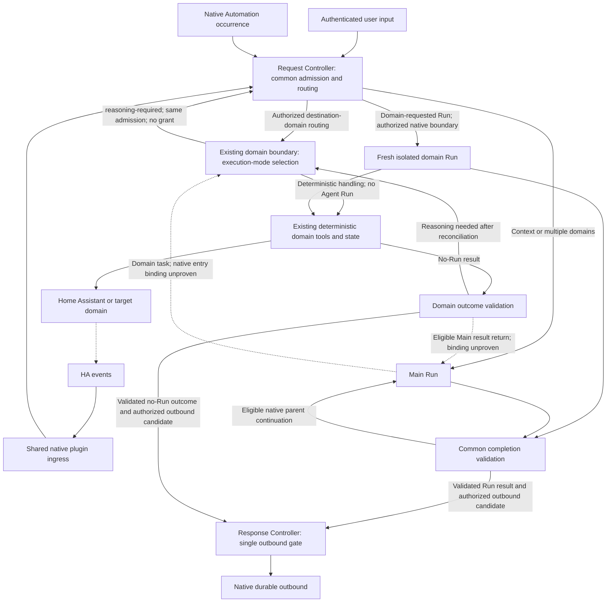

# Benson / OpenClaw Architecture and Operating Principles

**Canonical architecture owner. Language: English. Updated: 2026-10-10.**

**Status:** Oren approved the Deterministic-First, Domain-Owned, Event-Driven Agentic System target, D1–D6, Exclusive Domain Tool Ownership and unified domain entry, including scheduled domain operations. The [Implementation Plan](../BENSON_DECISION_ROUTING_IMPLEMENTATION_PLAN.md) owns validation/review and migration gates. These are approved design invariants, not claims of native support or implementation acceptance. Policy activation and production acceptance remain separate gates; Jessica's proposed default pending-start hours require explicit approval before implementation.

This document defines intended behavior, not installed state. Deterministic handling is the default; independent Run settlement applies whenever reasoning requires an actual Run. The General Workflow Engine is removed from the target. Durable Event-Triggered Conditional Actions remain an explicit, deferred capability under §17.5.

## 1. Purpose and scope

Benson provides one family interface to Jessica, reminders, Home Assistant and future home domains. Deterministic-First is a system-wide invariant: work that deterministic code can handle correctly, safely and reliably MUST use deterministic handling. Use an LLM only for necessary semantic interpretation, ambiguity resolution, reasoning or adaptive planning (§9). Authorization, correctness, verification, reliability and recovery must never be sacrificed for latency, tokens or cost.

The system reacts to authenticated user inputs, authorized native schedules and trusted domain events. Each input has its own disposition. An Agent Run may settle while a physical operation continues. A later event can update the domain without a model, or request a fresh authorized Run when reasoning is necessary. No LLM session must remain alive to keep a device operation, reminder or approved conditional action durable.

This revision changes architecture and planning documents only. It does not register services, introduce persistence, activate event handling, change tools or runtime instructions, enable queued cleaning, or authorize production/device actions.

## 2. Sources of truth

### 2.1 Architecture intent and planning

This document owns responsibilities, trust and lifecycle boundaries, reliability, security and observability. The root Implementation Plan owns migration, dependencies, proof gates and acceptance. Domain plans own capabilities, physical predicates and domain policy. Root `AGENTS.md` and `PLANS.md` own engineering procedure; scoped `AGENTS.md` files own current runtime instructions. A plan or historical implementation cannot silently redefine this target.

### 2.2 Current runtime state

Use focused current read-only evidence, then the latest valid `benson-context-*.md`, then canonical implementation/configuration, then older evidence. Record the observation time and scope. A snapshot is a capture, not a live guarantee. Failed queries establish neither absence nor health; a newer file inventory does not supersede an older successful runtime observation for a different fact.

### 2.3 Evidence levels

Distinguish source/contract tests, isolated native fixtures, runtime integration, production user-channel behavior and physical evidence. A source-level API or fixture cannot establish a loaded runtime binding, delegated authority, transport delivery or physical success. Preserve accepted evidence at its actual level.

### 2.4 History and uncertainty

Conversations and historical plans explain decisions but do not grant runtime authority. UNKNOWN must name the missing guarantee and minimum proof needed. Absence of evidence is not failure, success or non-support. Verified implementation divergence from approved target is IMPLEMENTATION DRIFT; record the affected owner without weakening the target to hide it.

### 2.5 Canonical boundaries

Do not duplicate domain policy, execution history, native job records or delivery state for visibility. Reference the responsible owner. Conflicting permissions, missing owners or unsupported bindings fail closed at the dependent feature. Preserve unrelated accepted capabilities.

### 2.6 OpenClaw compatibility contract

Use supported native plugin/runtime interfaces and verify the installed version before relying on them. The inspected line is OpenClaw `2026.9.6` (`eb377ac`); current upstream research is not proof of installed support. The evidence register in §27 and the Implementation Plan record gaps.

OpenClaw owns agent/session lifecycle, isolated child execution, transcripts, native Automations and outbound transport. Runtime tool policy, profiles, sandbox and allowlists grant capabilities; prompt text does not. Domain context belongs in `AGENTS.md`, including `## Tools`; standalone `TOOLS.md` is not an active contract. Isolated context is the default; transcript forking requires an explicit exception.

Reverify affected bootstrap/tool policy, spawn/yield and terminal semantics, trusted input provenance, scheduler callbacks, completion restrictions, delivery and core dependencies after upgrades. Native yield may end a turn or produce another Run; do not assume one `runId` survives it. Native API names below describe inspected primitives, not accepted end-to-end bindings.

## 3. System layers and component taxonomy

### 3.1 Component categories and ownership

| Component | Type and owner | Responsibility |
| --- | --- | --- |
| Main and domain agents | OpenClaw-managed model Runs | Language understanding and bounded semantic work; no durable control-plane authority. |
| Request, Completion and Response Controllers | Benson deterministic code in existing routing owner | Admission/routing, validated settlement, response eligibility and native handoff. Logical responsibilities, not new services or stores. |
| Decision / Response Model | Bounded, stateless, tool-free model calls | Optional classification evidence / explicit message-unavailable fallback. Neither grants authority. |
| Shared HA ingress | Proposed native plugin service under `integrations/openclaw/benson-routing` | Authenticated subscriptions, filtering, reconnect and bounded intake. OpenClaw owns service start/stop. |
| Domain core, executor and state | Existing domain owners | Internal deterministic/LLM execution-mode selection, intent validation, authorization, idempotency, resource claims, effects and evidence. |
| Home Assistant | Approved device integration boundary | Public observations and commands; acceptance is not physical completion. |
| Automations / outbound | OpenClaw | Durable schedules, native job/run lifecycle and transport queue/retry/receipts. |

### 3.2 Reference flow

All input classes pass the same logical Request Controller admission policy before reaching the one domain-owned entry (§8.1); Main delegation preserves that admission and trusted provenance. Diagram nodes denote existing responsibilities, not new components. Main delegates a task, never a mandatory LLM Run. The native Main-to-domain entry/result binding is unproven and its dependent routes stay disabled under G1/G11; G1(b) additionally gates fresh Run authority. Native scheduled deterministic work needs no Agent Run and retains G12. Completion Control validates actual Run settlement; the domain validates no-Run outcomes (§4.5). Neither path grants notification eligibility; domain eligibility/deduplication and the single Response/native delivery gate apply to both (§6.5).

### 3.3 Independent identities and lifecycles

| Identity / fact | Canonical authority | Must not be inferred from |
| --- | --- | --- |
| Input/admission identity and disposition | Trusted ingress plus routing admission | Message wording, timestamps alone, another user's request. |
| External conversation and sender | Native authenticated channel context | Child session key, quoted text or HA event fields. |
| Agent Run/session and terminal settlement | Native runtime plus validated common completion | Physical operation lifetime or queued outbound status. |
| Domain operation, device generation and effects | Domain operation owner | Current Run, latest cleaning, event receipt time. |
| Outbound message/intent and delivery status | Authorized response owner plus native outbound | Task success, model wording or provider acceptance as user reading. |
| Conditional action | §17.5 target-domain responsibility with native lifecycle binding to prove | A surviving Main Run or a generalized dependency graph. |

Request disposition, Run settlement, physical outcome and delivery outcome are separate facts. One input may spawn bounded child Runs; these are native parent-child relationships, not membership in a General Workflow. Deduplicate repeated delivery of the same input while preserving distinct intentional inputs. Domain operations may span many Runs with one stable original identity.

### 3.4 Persistent state

Keep conversation/Run history in native records, schedules in Automations, physical operations/resource fencing in the existing domain store, and message queue/retry/receipts in native outbound. Admission commitment and correlation use a proven supported native ownership boundary; their exact durable binding is a proof gate, not permission to create a routing database.

Domain metadata must be minimal, versioned, bounded and necessary for an invariant absent from native records. No central lifecycle registry, application-owned execution graph, duplicate transcript, custom outbox or independent delivery ledger is authorized. Unknown schema versions fail closed with recoverable evidence; migrations and rollback preserve operation/idempotency/frozen-delivery history.

## 4. Input admission and cognitive orchestration

### 4.1 Request Controller

Trusted admission captures immutable input identity, source class, principal/authority reference, external conversation when applicable, admission cutoff, cancellation state and a bounded request. User input, Automation occurrence and HA event are different source classes. An event must never be converted into an invented human turn.

Request Controller owns trusted admission, authorization and destination-domain routing for all three classes. Channel ingress, HA ingress and native Automations provide source-qualified inputs; transport authentication/filtering does not bypass admission or confer business eligibility. The same policy may run at supported native entry points without another dispatcher, service or registry. It validates the source grant, target domain, input bounds and cancellation/replay context before domain handling; the owning domain selects its internal execution mode under §8.1.

Deterministic routing policy validates source, permissions and enabled capability before execution. It selects the destination domain from trusted source/domain metadata, Main for semantic coordination, clarification or a typed rejection/conflict/unsupported result. Source-to-domain bindings retain canonical ownership in existing trusted ingress/admission context and the owning domain's registry (§18.1); routing consumes validated bindings, not entity-name heuristics, a duplicate registry or Jessica/Reminder-specific interpretation. Request Controller neither selects domain tools nor executes/schedules them, and never decides whether a domain needs an LLM. Direct domain handling requires the same authorization and evidence as Main delegation; routing to a domain does not itself require a Run or bypass missing bindings.

Admit and commit execution exclusively against the stable input/operation identity using a proven native or existing domain primitive. A retry or process race must not run both direct and Main execution. An uncertain commitment requires reconciliation. Do not claim NOT_STARTED unless evidence rules out a prior effect.

Admission deduplicates retried inputs when trusted input identity supports it; distinct HA observations or an Automation reconciliation of the same condition may legitimately be separate admissions. Do not invent replay identity from timestamps or equal text. The domain owns cross-source business deduplication. Its typed reasoning-required disposition requests a fresh domain Run through this same admission owner and the existing supported native lifecycle; it grants no execution authority. Before activation, the trusted admission/native boundary validates original requester/source authority, delegation provenance, cancellation, capability permissions and execution eligibility under G1(b)/G11 and all applicable gates. The domain cannot mint authority or impersonate a human. Preserve original input/operation identity, evidence and known/possible effects without replay; missing authority or an unproven binding keeps the Run path blocked.

### 4.2 Bounded Decision Model

When semantic destination classification is necessary, invoke at most one bounded, tool-free Decision call after deterministic context acquisition. Skip it when trusted metadata or an already-resolved bounded Main brief suffices. An authenticated but unclassified event may receive classification evidence; missing trusted binding or authorization still fails closed. Its output is never an execution grant, device command, recipient choice or trusted routing identifier. Deterministic policy validates any proposed destination against trusted bindings; the owning domain alone interprets event semantics and decides its execution mode. Known structured events normally use zero LLM calls. Classifier unavailability may select Main only with valid authority and a safe fresh admission that has not committed execution.

### 4.3 Main

Main is Benson's central cognitive orchestrator and sole user-facing agent. It resolves broad conversation, ambiguity and multiple domains, composes bounded domain briefs and combines validated outcomes, preserving partial, failed and unknown results. Direct/no-Run domain output reaches the same Benson interface through Response/native delivery; this does not require a Main model call or make a domain a separate user-facing agent. Main does not execute domain mechanics, calculate authoritative Reminder schedules or retain a long-lived physical-task controller.

Main and other agents delegate a domain task to the entry in §8.1, not an execution mechanism. Delegation MUST NOT automatically spawn a subagent LLM Run. The domain uses sufficient bounded structured intent deterministically, without repeating Main's resolved reasoning or adding a classification hop. When genuine reasoning is required, bounded native child execution remains subject to §4.1 and an eligible native requester lifecycle. Delegators cannot select/invoke domain tools, construct an executable bypass or register the domain's scheduled effects. The supported Main-to-domain no-Run entry and validated result return remain unproven under G1/G11; neither direct tool access nor a compulsory child LLM is an acceptable substitute.

Do not keep Main open until a robot finishes. After a requester Run has settled, a new input/event starts a fresh authorized activation if needed. The original request can truthfully conclude that a cleaning started or an approved future action was registered; it cannot conclude that the future effect happened.

### 4.4 Active steering and clarification

Active-run steering is deferred and disabled until exact supported binding, active generation, provenance and cancellation/terminal race handling are proven. Each steering input retains its own disposition. Queue acceptance does not prove consumption or application. A terminal or replaced Run cannot be steered; do not silently fall back to a follow-up, interruption or newly created Run.

Clarification is explicit requester-bound domain/native pending context, with identity, revision, cited evidence and expiry. An answer is a new admitted input to the domain entry; sufficient structured information is handled deterministically. If further reasoning is required after the prior Run terminated, it requires a fresh authorized Run. Unrelated senders/turns cannot satisfy the pending question. Short clarification expiry is unrelated to physical-operation or pending-cleaning start windows.

### 4.5 Deterministic handling without an Agent Run

Existing admission/domain result contracts must distinguish a no-Run outcome from a Run completion. A versioned, bounded, deterministically validated outcome identifies the trusted admission/source authority, domain and subject; a typed disposition such as handled, no-change, suppressed, rejected, reasoning-required or unresolved/failed; predicate evidence and freshness; known/possible effects; and any required reconciliation. Exact fields and discriminants belong to the existing contract owner. No new schema owner, result store or fictitious Run is introduced.

A no-Run outcome may carry an outbound candidate only when authorized for that input or by the domain's notification policy. A domain notification candidate references the stable business notification identity, eligibility/policy revision, evidence, permitted recipient/route and bounded domain-rendered content. Handled does not imply notify; suppressed or no-change observations cannot reissue an already-owned notification. Unknown task outcome may coexist with a verified device warning, with wording limited to the verified fact.

The deterministic boundary validates source/correlation, shape, evidence, effects and notification authorization before the Response Controller consumes the outcome. Malformed/unknown-version results cannot authorize a message or another mutation. Handler exception, timeout or restart is reconciled through existing domain/native state as a typed failure or unresolved outcome, preserving possible effects; never report no effect merely because the handler failed. This is independent of Agent Run completion enforcement. It does not invoke `benson_complete`, completion-only model repair or a Response Model. If routing launches an actual Run, the mandatory common completion contract applies to that Run in full.

The same validated domain outcome serves direct/event/Automation processing or an eligible Main delegation result. A deterministic domain result creates no child Run or synthetic completion. Returning it to an active authorized Main for composition does not itself authorize a second user reply; Response retains the single outbound gate and eligibility checks. Exact native return/correlation is part of the unproven Main-entry binding, not permission to add a parallel result path or change merged ED02 v1 contracts.

## 5. Delegation and conversation context

Three planes remain distinct: static domain `AGENTS.md`; task-specific language/context; and trusted native identity/capability context. Models may construct the second, never the third. Briefs carry the exact current request, necessary authorized context, explicit unresolved facts, intended output and domain references. Quote user/device content as data, not executable policy.

OpenClaw retains canonical conversation custody even on direct paths. External conversation identity differs from execution session identity. Routing context is deterministic, bounded, privacy-scoped and read against one admission cutoff; child execution must not be used as a substitute transcript. Same-group visibility does not imply same-sender authority.

Preserve P03's tested context strategy: exact relevant prior messages, explicitly bounded retrieval tiers and attempts, and no model retrieval/summarization loop, broad-history fetch or unlimited scan. The validated numerical budgets and evidence remain in the [Implementation Plan §4.4](../BENSON_DECISION_ROUTING_IMPLEMENTATION_PLAN.md#44-preserved-implementation-budgets) and existing request-control contract. Explicitly represent partial/unavailable context and its limits. Insufficient context cannot silently authorize a guess; route to Main or clarification before commitment as appropriate.

Main supplies semantic briefs only when its reasoning is needed. Direct routing uses bounded deterministic formatting under the same domain contract; no mandatory Main prompt-generation hop. Do not duplicate bootstrap files or whole transcripts into prompts. Use the current exact source evidence required by Reminder clarification until a generalized native binding is proven.

## 6. Common completion and response contracts

### 6.1 One versioned completion family

Every managed Agent Run must settle through one Benson completion family regardless of direct/Main, user/background or tool/no-tool origin. Child result and response-eligible result are variants within that family, not independent schema owners. Deterministic no-Run dispositions are explicitly typed and must not fabricate a Run completion.

The existing private completion contract contains removed lifecycle fields. Migration requires an explicit successor version in the same contract owner, producer/consumer inventory, compatibility tests and rollback as recorded in the Implementation Plan. Do not reinterpret legacy fields in place or publish preparatory constructors as runtime support. Retain strict legacy readers only for identified consumers/records during migration; reject unknown versions without discarding effects.

The common contract retains trusted input/Run/domain correlation, domain results, action-specific outcome/evidence, warnings, side effects, verification gaps, response availability and safe presentation. Model-supplied IDs do not establish binding. `NORMAL`, `RECOVERED` and `FAILED` describe completion quality separately from business outcome. A recovered report may contain verified success; a failed report must preserve known or possible effects.

Preserve tested bounds and lossless reconstruction obligations in the existing completion contract; numerical limits and historical payload measurements are retained in the [Implementation Plan §4.4](../BENSON_DECISION_ROUTING_IMPLEMENTATION_PLAN.md#44-preserved-implementation-budgets). A source-contract bound is not proof that a native carrier accepts the payload. Any changed limit requires explicit contract review and consumer/carrier proof; never truncate accepted child facts to fit a new projection.

### 6.2 Trusted routing and settlement

Execution selection precedes execution. Completion destination is native-authorized context: an eligible parent continuation, an authorized response path, or native Run settlement with domain reconciliation references. An agent cannot redirect a completion or choose a recipient. No completion path retains an orphaned General Workflow or invents a parent.

Completion validation binds the exact Run, input and authoritative deterministic tool results. Reject mismatched, duplicate or stale submissions without replaying effects. Completion eligibility is independent of outbound eligibility. A background Run may settle with no message. Native records and domain state retain its facts.

### 6.3 Global terminal enforcement

The target requires automatic settlement for natural return, error, cancellation, timeout and interrupted Runs on every enabled harness. `benson_complete` denotes the conceptual completion submission boundary, not a verified installed API. These requirements apply to every actual managed Agent Run; deterministic no-Run outcomes use §4.5 and cannot be used to disguise or exempt a Run.

Before irreversible native termination, supported bounded same-Run completion repair may run with mutation and delegation disabled. Persist/enforce that restriction across the repair boundary. Missing/malformed protocol data is a completion failure, not permission to rerun the task or invoke a wording model.

Once a Run is terminal, it cannot be resurrected. Deterministic reconstruction uses trusted retained evidence to produce RECOVERED settlement, or a FAILED report with preserved effects and uncertainty. No extra reporting Run, task replay or fresh-Main repair loop is allowed. If the installed terminal hooks cannot enforce this contract, the affected new execution path remains gated; do not claim universal protection from a natural-final hook alone.

### 6.4 Owner wording and Response Controller

The semantic owner is Main for Main composition and the domain for direct domain results or deterministic event wording. Known outcomes should use domain-local deterministic templates; otherwise the existing Run composes its own wording. The Response Controller is the sole outbound gate for both validated Run results and validated no-Run outcomes: it checks the authoritative response/notification eligibility reference, schema, bounds, trusted destination and prepared payload. It does not independently decide domain alert eligibility, re-judge prose with another model or become a second domain interpreter.

Only an otherwise valid completion explicitly marking user wording unavailable may invoke one bounded tool-free Response Model. Supply verified facts and authorized response scope only. Failure yields deterministic truthful wording. Empty, malformed or missing required fields follow completion repair, not this fallback. No normal second-model review or response-to-Main loop.

### 6.5 Outbound classes and frozen delivery

Distinguish an input's response, eligible active-run progress, authorized domain notification and scheduled delivery. Each has its own identity and policy. Progress is best effort, active-only, and proves neither completion, success nor resource release. Events after terminal settlement are separate notification candidates, not delayed progress or a shared final.

| Responsibility | Existing owner / invariant |
| --- | --- |
| Input admission and route | Request Controller (§4.1), regardless of user, HA or Automation source. |
| Notification eligibility, business identity and duplicate suppression | The relevant domain policy/state owner, including device-condition episode, verified clear/re-arm and any explicitly allowed update/re-alert. The same decision is consumed by both Run and no-Run paths. |
| Result validation | Completion Control for a Run; the existing deterministic domain result boundary for no-Run handling. Validation/settlement does not create a second notification grant. |
| Outbound eligibility enforcement and handoff | One Response Controller validates the domain decision and authorized route for either path, then freezes the native intent. It does not maintain a second business-eligibility ledger. |
| Delivery attempts, receipts and transport recovery | Native outbound, with stable intent adoption/reconciliation; no Benson outbox. |

For the same condition episode, semantic notification kind and authorized recipient, duplicate events, scheduled reconciliation and a reasoning Run must converge on the same domain-owned notification identity and eligibility claim. Event ID or Run ID alone is not that identity. A Run completion referring to a notification already owned by deterministic handling may settle normally but cannot emit another copy. Explicit replies to separate user queries remain independent responses; they do not re-arm the proactive alert.

The existing domain owner serializes eligibility changes and rejects stale/contradictory candidates against the authoritative episode/evidence revision before handoff. Same notification identity plus different payload is a conflict requiring reconciliation, not another send. New severity/clear/re-alert messages require a genuinely new policy-authorized notification transition; a duplicate event or policy reload alone cannot create one. Wording states the verified observation and its time/scope, without upgrading an old observation to a current-state claim. This requires minimal business state in the existing domain owner, not another router, response owner or transport store.

Before transport, freeze an immutable authorized payload and route with a stable native delivery identity. Retry/recovery must deliver the same payload, not rerender or reinterpret domain state. Native outbound owns queue persistence, attempts, backoff and receipts. Queue acceptance, provider acceptance and user reading are distinct. Execution success remains true or uncertain independently of failed delivery.

Prove the gap between domain notification eligibility and native durable intent creation, including crash-after-accept-before-ack. Reconcile by stable identity; do not blindly send again. Domain business episode state is allowed in its existing owner; a Benson outbox, transport ledger or custom dispatcher is not. Native handoff/dedup/recovery is an explicit implementation proof gate.

## 7. Native Run and runtime lifecycle

### 7.1 Fresh isolated activation

When the owning domain requires reasoning for a new independent task or event, use a fresh isolated authorized domain Run. A new task or Main delegation alone does not require activation. Reuse only stable domain operation identity and the minimum trusted context, never the previous Run's mutable permissions. Native delegation preserves requester relationships only while those relationships are eligible. Session identity is not a permanent physical operation ID.

### 7.2 Loaded environment

Each agent receives its native-loaded domain contract and only allowed tools. Verify actual tool policy and prompt loading. No model-controlled shell, raw HA, arbitrary filesystem/config edits, channel sending or sibling tools may substitute for approved domain boundaries. A direct/background path does not automatically inherit Main's tool bindings.

### 7.3 Temporary context

Transient Run context supports bounded reasoning only. An in-memory runtime context, system-event queue or captured dispatch closure is not durable authorization. Reconstruct fresh context from canonical owners after restart or a later event.

### 7.4 State and cancellation

A Run cancellation settles that Run. It does not imply a device stopped, a Reminder was deleted or a pending action was canceled. Domain cancellation has its own authority, atomic claim race and evidence. Preserve uncertainty and reconciliation barriers when execution might have occurred.

### 7.5 Waiting

Use native yield/wait for bounded native child coordination where supported. Do not poll with an LLM, keep a Run alive through a cleaning cycle, or infer cancellation from `waitForRun` timeout. Durable physical waiting belongs to the domain operation plus native event/schedule mechanisms.

### 7.6 Native OpenClaw first

Prefer supported native lifecycle, transcript, scheduling, persistence and outbound primitives. Inspect installed source/SDK and current upstream before selecting a significant binding. An internal API, copied runtime module or patched fixture is not an unmodified public SDK proof. Trusted-official-only interfaces are not available merely because Benson can import them.

If no supported primitive meets a required guarantee, document the missing guarantee and compare alternatives. Keep the dependent feature disabled pending a separate architectural decision. Do not automatically add a service, database, scheduler, framework, MCP/A2A layer or core modification. Existing core changes are individually inventoried implementation drift; preserve effective safeguards until replacement and rollback are proven.

### 7.7 Capacity and resource safety

OpenClaw owns Run concurrency/queue mechanics. Domain admission and the existing device store own physical mutual exclusion, fencing and operation sequencing. Process-local limits or a native Run slot do not prove cross-process device safety. There is no new global domain-capacity manager in this target.

Jessica's optional pending-cleaning queue is domain-local (§18.4), not a queue of suspended Runs. Persist stable operation ownership and generation before effects; reject stale owners immediately before dispatch. A timeout, lease expiry, terminal Run, docked state or empty native queue cannot release an uncertain physical resource.

## 8. Minimal agent context and tools

Keep each `AGENTS.md` concise: role, allowed domain behavior, trust boundary, verification and tool guidance. Native schema and effective tool policy are authoritative for callable capabilities. Avoid standalone `TOOLS.md`, repeated root instructions, broad environment dumps and duplicated contracts.

Runtime agents have zero skills by default. Add a skill only for a concrete approved missing responsibility; engineering tools do not imply runtime permission. Deterministic tools own validation, execution, verification, persistence and compensation. Architecture and plans explain design outside the runtime prompt budget.

### 8.1 Exclusive Domain Tool Ownership

Every current or future operational domain has one logical domain-owned entry for direct user requests, Main-delegated tasks, trusted structured events, authorized Automation occurrences and future separately approved sources. The Domain Handler / Domain Entry is a minimal execution-mode selector within existing canonical domain owners: its routing decision MUST be strictly deterministic, with zero LLM calls for every input origin. It selects an existing authorized deterministic domain capability when sufficient, returns the existing typed reasoning-required disposition only when semantic reasoning is genuinely needed, or rejects unsupported/unauthorized input through existing contracts. It never grants authority or launches an Agent Run itself; activation belongs to §4.1's trusted admission/native boundary. It is not an agent, orchestrator, workflow engine or Run manager; no new plugin, handler layer, abstraction or duplicate schema is introduced. All existing no-Run dispositions and contracts (§4.5) remain intact. Main delegation does not require a domain LLM Run, and a domain may be entirely deterministic.

The domain exclusively owns business semantics, tool selection, domain authorization, execution, verification, state and outcome evidence for reads, writes and scheduled operations. Its existing deterministic boundary validates intent, trusted authority, capabilities and effects for both execution modes; an LLM may interpret unresolved semantics and select approved tools but cannot authorize them. A headless invocation is not permission for Main, Reminder or another agent to call the domain's tools. Sufficient structured intent uses the same deterministic execution boundary without another model call.

Enforce ownership through effective native tool policy and deterministic domain checks, not prompt wording or a caller-supplied agent/domain ID. Main and non-owning agents must lack both direct domain-tool access and indirect bypass through generic execution, code-mode, raw HA/device calls or native job management. Reuse existing domain adapters and generic utilities without moving policy into them; no generic tool registry, duplicate adapter or parallel policy owner. ED01 must prove effective isolation and the headless binding before enabling dependent paths; an unproven boundary keeps that capability blocked.

## 9. Deterministic versus agentic responsibilities

Use LLMs only when semantic interpretation, ambiguity resolution, reasoning or adaptive planning genuinely requires one. Known mechanical operations, known structured events, already-resolved reasoning and deterministic workflows MUST NOT require an LLM. Source admission, authorization, validation, event parsing, routing commitment, effects, time/schedule calculations, state transitions, idempotency, transactions, verification, completion and delivery handoff belong to deterministic code. Necessary wording follows §6.4; known outcomes use deterministic templates.

A model output is never an authorization token, resource lease, success proof or persistence instruction. Minimize model calls, Agent Runs, cognitive hops, latency, tokens and total execution cost without weakening §1's safety/recovery priorities. Known typed event reconciliation and a fully specified reminder fire normally use zero model calls; sufficient Main-delegated intent adds zero domain model calls. A direct task uses its domain LLM only when reasoning is needed, without mandatory Main. Repeated mechanics belong in existing parameterized owners.

## 10. Reliability, idempotency and recovery

Observe the action-specific success condition. HA service acceptance, optimistic cache changes, model statements and provider ACKs prove different things. Keep structured errors with stage, safe reason, possible/applied effects, evidence limits and next permitted disposition.

Bind retries to stable business identity, not text similarity or current Run/event ID. Repeating the same input/occurrence must not produce another physical effect or Reminder. Distinct authorized inputs remain distinct. Claim before effect; preserve identity across restart and reconciliation. Unknown dispatch outcome retains its barrier until evidence resolves it; never reset to ready for convenience.

Read retries may use bounded backoff. Mutation retry requires proof of no prior effect plus current authorization and policy. Reconcile possible effects before replay. A terminal source failure/cancellation is not successful completion. Replacement invalidates the old correlation; do not retarget an old request to the latest operation.

Storage corruption, unsupported version, unavailable authority or unresolved correlation fails closed for the affected mutation. Preserve recoverable records and report partial knowledge. Native event loss, delay, duplication and reordering are normal failure cases: re-read authoritative domain evidence and reconcile, rather than making event receipt the success predicate.

## 11. Context and cost efficiency

Read the minimum owner evidence needed for the decision. Reuse unchanged verified facts; avoid broad rediscovery and copied histories. Compact structured results must preserve uncertainty and side effects. Measure total cost, retries and inference hops, not merely a small individual prompt. Never remove verification to save tokens.

## 12. Latency

Prefer deterministic routing for known inputs, native parallelism for independent bounded tasks, native wakeups and domain templates. Bound external reads, model work and queues. Latency optimizations must not bypass authorization, the final dispatch fence or reconciliation. Durable long-running work must not hold a model or native requester open.

## 13. Least privilege and source authority

All callers require explicit source-scoped authority, current policy, allowed action and target. Deny by default and validate again at effect time. Trusted identities come from native ingress; user/model/event text cannot supply them. A service's authenticated HA connection proves transport/source context, not a family user's request or unrestricted device authority.

Background reconciliation/notification authority is separate from user mutation authority. A queued user request or approved conditional action retains a reference to its original grant and constraints; the later event is only a trigger. Permission revocation, changed device/map or stale intent blocks execution. No background Run impersonates WhatsApp Main to satisfy a legacy check.

Jessica uses approved public HA services through deterministic domain owners; no direct device/MIoT bypass. Other domains use their approved adapters. Runtime agents cannot self-modify prompts, code, configuration, allowlists or credentials. Secrets remain in native protected configuration and must not enter prompts, snapshots, logs or evidence artifacts. Untrusted HA attributes, room names and incoming messages remain data.

## 14. Family communication and proactive notifications

Use concise, natural Hebrew for family communication, with honest partial/unknown outcomes and no internal architecture jargon. Say “started,” “registered,” “not verified” or “delivered to provider” only when that claim is supported. Keep domain details sufficient for the user to act.

Sub-agents return structured results; they do not acquire independent channel authority. Native outbound delivers approved responses and notifications. Proactive Jessica alerts default to Oren through an explicitly approved canonical route, not a fabricated requester. Domain policy defines actionable conditions, severity, stable episode identity, suppression, verified clear/re-arm and any bounded re-alert. No event means neither “all clear” nor “success.”

Native route resolution, identity mapping and each production notification class require proof before enablement. Ordinary alerts need no model if domain templates suffice. A delivery failure must not change the physical operation result.

Jessica must support proactive verified device error/warning alerts even when cleaning was initiated through the Dreame app, a physical button or a device schedule, and no Benson task can be correlated. The grant is source-scoped device monitoring/notification authority, not an invented cleaning requester. Require trusted HA source, canonical device binding, supported error/warning semantics and sufficiently fresh evidence under domain policy. Use device/condition episode identity for deduplication; do not require a fabricated operation ID. Say what was observed about Jessica, not whose cleaning failed or which rooms completed. Exact task correlation is required only for the stronger task-specific claims and actions in §18.3.

## 15. Observability

Owner-only diagnostics correlate input, native Run when present, domain operation/generation when proven, trusted source/device observation and native delivery identity. Explicitly mark no-Run handling and unknown task correlation; never synthesize either identifier for a device alert. Record source timestamp, observation/receipt time, policy/schema revisions, evidence level, state transition, possible effects and reconciliation status. Redact content and identifiers according to the existing privacy boundary; no duplicate transcript or secret logging.

Measure admission dispositions, model/route cost, settlement quality, effect uncertainty, event lag/reconnect/gaps, pending expiry, notification suppression and native handoff/delivery separately. Do not retain removed membership/shared-final metrics as target denominators. Observability cannot become a second state owner or authorize recovery actions.

## 16. Models

Choose models for measured task reliability, supported tools/context, latency and total cost. Main may require stronger semantic reasoning; a narrow domain may not. Deterministic policy controls configured selection and safe fallback before commitment. Provider retry/fallback must not repeat committed effects. No hardcoded model hierarchy substitutes for current evaluation.

## 17. Scheduling, reminders and conditional actions

### 17.1 Existing native scheduling owner

OpenClaw Automations remains the shared scheduler, native job lifecycle and persistence owner. Each domain authorizes registration and management of its own scheduled operations through its existing deterministic boundary, owns their business/time semantics and validated native payload, and reuses existing generic time/scheduling utilities. Main or another domain may delegate the request, but cannot register, edit, enable or force-run it around that boundary. Use supported native create/get/list/edit/enable/disable/remove/run/history surfaces only after proving their binding; do not duplicate native jobs/history or introduce a scheduler/framework.

A domain LLM may resolve the initial semantics; subsequent fully specified occurrences execute deterministically through the same domain authorization, execution and verification boundary. Registration succeeds only after durable native readback. Preserve trusted original requester/grant, approved action and definition revision across registration, edits, native occurrences and recovery. Reauthorize against current policy immediately before effects, including manual/force-run; a scheduler/admin identity or stored sender string does not replace the original grant. Revoked or unresolvable authority blocks dispatch. Use stable job/occurrence/revision effect identity across retry/restart; reconcile lost acknowledgments before replay. Cancellation, disablement and semantic edits must fence stale occurrences against the domain dispatch claim: cancellation winning prevents dispatch; a prior possible effect remains reconciliation-owned, not silently undone.

A simple precomposed reminder fires deterministically. A scheduled model Run is appropriate only for explicitly required future reasoning and follows the same completion contract. Native headless execution and effective tool isolation are unproven ED01 gates, not support implied by an Automation payload kind. No mandatory LLM hop, privileged command wrapper or new execution adapter is an automatic fallback.

### 17.2 Reminder transactions

Reminder owns Reminder operations only, including their schedule normalization, authorized lifecycle and Calendar linkage; it does not own Jessica scheduling authority. Preserve one deterministic transaction for a logical Reminder request, including a bounded schedule-by-recipient matrix and independently scheduled Calendar event when requested. Stage, verify, commit enablement, read back and compensate all staged effects on failure. Do not split one logical transaction into agent-managed create calls. Keep existing creator/recipient authorization, timezone/DST handling and verified Automation-to-Calendar linkage in their owners.

### 17.3 Clarification continuity

Reminder pending context carries immutable turn evidence, stable context ID/revision, current-turn evidence, expiry and field citations. The domain compares it with trusted canonical conversation evidence, including the required same-sender turns. Reject stale, foreign, altered or incomplete provenance before mutation. Preserve the current Main-bound proof until direct or background binding is independently accepted. Native question state is not created from a completion-report Run.

### 17.4 Scheduled Jessica work

Jessica exclusively owns scheduled-cleaning semantics, authorization, registration/management admission and physical execution/verification; OpenClaw Automations owns the schedule, job lifecycle and persistence. The Jessica deterministic boundary registers the authorized native job and later receives its trusted headless occurrence through the common admission policy. Reminder is not an intermediary or executor. Store approved semantic targets/settings, original authority, definition revision, timezone, conflict and late-execution policy, not raw HA commands. Revalidate map/capability and apply §17.1's occurrence identity and cancellation/revocation fences before movement. No LLM must be alive at fire time. Until that exact native binding is proven, scheduled Jessica actions remain unavailable; accepted interactive operations are not evidence of scheduled authorization. Pausing a schedule is distinct from pausing the robot. Domain pending-cleaning (§18.4) and source-triggered target actions below are different capabilities.

### 17.5 Durable Event-Triggered Conditional Actions — explicit deferred capability

The target retains: **“After Jessica successfully finishes this cleaning, create a Reminder.”** Initial scope is one approved predicate over one exact source-domain operation, triggering one preauthorized target-domain operation once. No DAG, generalized dependencies, dynamic chain, JOIN/CLOSE, shared final or general-purpose engine is permitted.

| Boundary | Minimum responsibility |
| --- | --- |
| Registration | Main/domain reasoning resolves source operation, target content/recipient/time semantics, validity window and late-event policy. Trusted admission binds the original principal and permitted action. An incomplete request is clarified before registration. |
| Source owner | Jessica establishes exact device/operation/generation and versioned success predicate from independent evidence. Events are hints; failure, cancellation, replacement or UNKNOWN never satisfy success. |
| Target owner | The Reminder owner validates and executes the approved creation transaction, owns target idempotency/result reconciliation, and exposes cancellation/status through its existing lifecycle boundary. |
| Durable lifecycle / wakeup | Prefer existing native Automations registration, state and wakeups. Exact record ownership, atomic claim/cancel API, source-event binding and target authorization are UNKNOWN implementation gates. |
| Delivery | Registration response and any later authorized result notification use §6.5. Native transport owns message attempts; neither source nor target gains a custom messenger. |

There must be one authoritative conditional-action record, not one per Run or duplicated in both domains. Its minimum logical contents are schema/version; action ID and definition revision; admission/principal/grant reference; exact source device/operation/generation and predicate version; bounded target action/digest and recipient/time anchor; validity/late policy; lifecycle revision and claim/cancel state; native execution, target result and evidence references. These are required facts, not a newly approved schema/store. Retention must preserve unresolved effects and duplicate prevention for the supported replay horizon.

Native Automations is the preferred record/lifecycle host. If it cannot supply the invariant, document the gap and seek separate approval for the smallest extension of existing target-domain native persistence. No central registry, new persistence infrastructure or alternate scheduling framework is implied by preserving this capability. Until one host and atomic ownership contract are proven, registration/execution remains disabled and status must say unavailable, not registered.

Registration and effect-time checks verify current delegated permission, action digest, recipient, source binding and validity. A trigger event or Decision output grants nothing. A target idempotency key derives from conditional-action ID plus definition revision, independent of event/Run IDs. A semantic edit requires a new reviewed revision and explicit disposition of any prior claimed effect; no silent rearming or retargeting.

The logical lifecycle distinguishes awaiting predicate, claimed/executing, completed, canceled/expired and reconciliation-required states; names and native representation are to be bound during implementation. The authoritative owner atomically orders cancellation against execution claim. Cancellation winning means zero dispatch. Execution winning yields a truthful pending/too-late result based on evidence, not an implicit rollback, robot stop or Reminder deletion. Source cancellation/failure/replacement terminates eligibility or requires authorized disposition; it never targets a subsequent cleaning.

Recovery reuses the same action/effect identity. If Reminder creation succeeded and acknowledgment was lost, locate and verify the existing target transaction; do not create another. If the source event was missed, recover only from evidence proving the exact source predicate and a still-valid grant/window. UNKNOWN stays reconciliation-owned. Expired actions do not execute on restart. “One hour after completion” uses the verified source completion time; missing time or a target time already in the past follows an explicitly approved policy, never an invented new anchor.

The initial request may settle with “conditional action registered” only after durable registration readback. It must not report “Reminder created.” Later predicate evaluation and target execution are independent deterministic processing or a fresh authorized Run if semantics truly require reasoning. The capability remains in the target while deferred; base rollout must state that limitation, and full capability acceptance cannot claim it is implemented.

## 18. Home Assistant and Jessica

### 18.1 Shared event ingress

Extend the existing `integrations/openclaw/benson-routing` owner with a supported native plugin service, subject to future registration approval. OpenClaw owns start/stop. Ingress owns authenticated HA WebSocket connection, allowlisted subscriptions, bounded parsing/filtering, backpressure, reconnect/resubscription and health. It supplies typed source observations to the common admission policy (§4.1); it does not independently admit domain actions, own notification predicates or run a generic action engine. Do not locate multi-domain ingress inside Jessica's tool plugin.

The domain owns entity/device registry binding, event semantics, freshness, action/tool selection, reconciliation and notification eligibility. Generic Request Controller routing consumes the trusted source/domain binding and validates routing authority; neither it nor shared ingress interprets domain-specific event meaning. Stable device mapping must resolve the observed `vacuum.jesica` event alias against `vacuum.jesica_jesica` within the domain registry; device `did` is not a task ID. Known structured events use the existing domain entry deterministically and return validated typed no-Run outcomes. Genuine unresolved semantics may request a fresh authorized Run; ambiguous/unknown events never gain authority through model guesses. Untrusted attributes cannot become tool instructions.

HA WebSocket subscriptions have no proven replay cursor. Reconnect must declare a gap and trigger bounded authoritative reconciliation. Coalescing may discard redundant observations, never indispensable operation evidence; if bounded intake cannot preserve evidence, mark the dependent outcome UNKNOWN and reconcile. No new event database/queue is authorized.

### 18.2 Jessica operation and resource owner

Keep Jessica's deterministic core, approved HA boundary, map registry and existing native operation-state namespace. Preserve P04's atomic reservation, resource generation/revision, requester/original-operation ownership, pre-effect fence and history. Extend that owner for event-driven evidence and domain-local pending work only in approved implementation stages.

An Agent Run ending does not retire a physical operation. Release requires independently verified release/readiness; stop/dock acceptance, timeout, optimistic `completed:true` or a docked cache value is insufficient. Old owners may not dispatch after replacement or reconciliation. A fresh Run must prove authority to reference the original operation; its child session key is not a cross-Run substitute.

### 18.3 Physical completion and safety

Retain accepted bounded room, pause, dock and setting behavior at its documented scope in the [Jessica Full Capability Plan](../agents/jessica-vacuum/FULL_CAPABILITY_PLAN.md). Do not expand room sets, full-home, order, repeats, resume, stop or completion claims from event availability.

Physical completion correlation remains unproven. The inspected integration can emit optimistic terminal state before a command POST and projects lossy history. A task event or terminal boolean does not prove successful completion of the exact requested rooms. Require source-qualified task identity/generation, correct scope, independent successful terminal evidence and applicable release evidence. Contradictory, delayed, cached or uncorrelated observations remain UNKNOWN. Investigate public installed surfaces first; a missing guarantee may justify a separately approved integration change, never weaker predicates or a raw-device bypass.

Device error/warning evidence and exact cleaning-task evidence are separate predicates. A verified device fault may justify §14's alert despite unknown task identity or external initiation. It cannot establish successful cleaning, release Benson's physical ownership, adopt an external task as the owned operation, advance pending cleaning or trigger D6's success-dependent action. Alert delivery/acknowledgment and verified fault clearance do not satisfy those stronger predicates either.

### 18.4 Pending cleaning — D5

An explicit “do this after the current cleaning” opt-in may create a bounded FIFO entry in Jessica's existing operation store. Ordinary busy requests are not silently queued. Domain policy owns the explicit pending capacity in Jessica Full Capability Plan §7.4; active work is separate. There is no suspended Agent Run or shared final.

Persist the stable original request/operation identity, principal/grant, reviewed target and intent/map/policy revisions, ordered queue position, source/predecessor binding, earliest/latest allowed start, status/claim/cancel revision and effect/evidence references. Admission and claim must be atomic under the existing device owner. Revalidate permission, capability, map, time window, predecessor success and independent device readiness immediately before any effect. FIFO means no silent overtaking or retargeting; a blocked head needs explicit disposition, while an expired/canceled pending entry can be removed without implying that active work succeeded.

Only verified successful predecessor completion plus independently verified release permits automatic advancement. Active-operation failure, cancellation, replacement or UNKNOWN blocks automatic advancement pending authorized disposition. Natural recharge, pause/resume within the same proven operation does not create another cleaning or a short timeout-based release.

`latestStartAt` is a last permitted dispatch/start boundary, not a maximum cleaning duration. It never stops an active cleaning, frees its resource or authorizes the next request. The practical default proposal, its rationale and policy-approval gate are owned once in Jessica Full Capability Plan §7.4. Explicit user windows override only within approved domain policy. Do not import the removed pending-Workflow expiration policy or the unrelated clarification TTL.

Persist the chosen absolute bounds and timezone/policy revision at admission; duplicate delivery, restart and retries never slide them. Expired pending requests settle without dispatch and do not silently move to tomorrow. Cancel-before-claim means zero effect; after claim/possible dispatch, reconcile and report the actual stage without inventing a physical stop. Native mechanisms supply wakeup; the domain store is authoritative if a wakeup is delayed or lost. A default policy must be explicitly approved before implementation.

## 19. Files and ownership

| Owner | Canonical responsibility |
| --- | --- |
| `architecture/BENSON_SUBAGENT_ARCHITECTURE.md` | This system contract. |
| `BENSON_DECISION_ROUTING_IMPLEMENTATION_PLAN.md` | Rewrite/migration sequence, evidence gates and accepted/deferred state. |
| `integrations/openclaw/benson-routing` | Existing admission/context/completion/response sources; prospective shared ingress extension. |
| `integrations/openclaw/plugins/benson-jessica-tool` and `agents/jessica-vacuum/lib` | Trusted Jessica tools, deterministic core, HA adapters and operation owner. |
| `agents/jessica-vacuum/FULL_CAPABILITY_PLAN.md` | Device capabilities, physical predicates, domain policy and FC evidence. |
| Reminder core and `integrations/openclaw/plugins/benson-reminder-tool` | Reminder transactions, provenance, native job/Calendar linkage. |
| OpenClaw native owners | Sessions, transcripts, lifecycle, Automations and outbound. |

Existing private schemas and tests are implementation evidence; this document does not create parallel owners. Historical migration/deployment records remain historical and cannot reactivate removed legacy executables or override this target.

## 20. Engineering and maintenance

Follow root `AGENTS.md` and `PLANS.md` for checkpoint, approval, validation, review, publication and snapshot rules. Canonical documentation changes do not authorize runtime exposure. Keep implementation stages bounded and migration reversible where possible. Remove obsolete code only after reference/consumer inspection, accepted replacement and preserved recovery history.

Record material native decisions with the question, installed/current sources, alternatives, tradeoffs, chosen direction and applicability. Put stage-level evidence in the Plan and domain predicates in their domain owner rather than repeating them here.

## 21. Snapshots and recovery artifacts

Use verified `bensonsnap` evidence for accepted or intentionally preserved runtime state, with capture time and limitations. For source/documentation work, normally snapshot after accepted merge and main sync; preparation alone needs no runtime snapshot/reload. Preserve the last known-good recoverable point and unresolved-operation evidence. Cleanup requires the engineering retention/approval rules; file restoration cannot undo physical actions or sent messages.

## 22. Project sources

Keep this architecture, active implementation/domain plans and the latest valid captured-state snapshot available as distinct sources. Mark historical migration plans and snapshots clearly. Do not treat several inconsistent snapshots as one current state or copy architecture into prompts for discoverability.

## 23. Prohibited substitutions

No General Workflow Engine, JOIN/CLOSE membership, shared-final aggregation, central dependency graph or terminal-Run resurrection. No callback that assumes every native continuation preserves `runId`. No custom scheduler/outbox, model-owned resource release, event-as-success predicate, fabricated sender, private official-only API workaround or unreviewed core modification.

Do not remove legitimate Dreame saved-program `workflowId` fields merely because their vendor name contains “workflow.” They identify device programs, not the removed Benson engine. Ordinary engineering procedures and atomic Reminder transactions also remain valid.

## 24. Reference flows and acceptance examples

| Input / event | Required target behavior and evidence |
| --- | --- |
| “Clean the kitchen.” | Trusted admission routes to Jessica, which selects deterministic handling or requests an eligible fresh Run for reasoning. Reviewed map/permission, atomic operation claim and deterministic verified start result remain mandatory. Settle any actual Run truthfully; physical cleaning remains domain-owned. Main remains valid where direct binding is unproven. |
| History-dependent rooms | Bounded canonical context; Main resolves semantics if needed. Domain rejects ambiguous/stale targets. No known-subset dispatch for an unresolved collection. |
| Independent Reminder + Jessica + conversation | Main delegates bounded tasks to each owning domain's unified entry. Sufficient structured intent is deterministic; only a domain requiring reasoning requests an eligible native child Run. Preserve each validated result, partial outcome and effect. Main-entry/result bindings must be proven first. One response to this input does not merge subsequent inputs into shared finality. |
| “Clean the kitchen tomorrow at 10:00.” | Jessica resolves and authorizes the request, registers/readbacks the native Automation through its deterministic boundary, and reauthorizes/verifies its later headless occurrence. Main only delegates; Reminder has no Jessica scheduling authority. Missing headless/isolation proof means unavailable, not an LLM or command bypass. |
| Cleaning finishes after its initiating Run ended | Ingress routes a typed hint; Jessica verifies the exact operation. Deterministic state update and eligible notification, or a fresh authorized Run if reasoning is needed. No resurrection. Physical correlation and delivery gates remain prerequisites. |
| “Clean the hall after this cleaning.” | Explicit pending admission under approved D5 window. No new physical start until exact predecessor success, release and all current fences pass. Expiry/cancellation never stops the active robot. |
| “After this cleaning succeeds, create a Reminder.” | Deferred D6: durable, preauthorized single predicate/action registration; later exact source proof and target idempotent transaction. While binding is unproven, report unavailable/clarify, never promise registration. |
| Malformed completion after a real cleaning start | Restricted same-Run repair when possible; otherwise trusted reconstruction retaining the effect. No second cleaning or fresh reporting Run. |
| Crash at native outbound handoff | Reconcile the immutable native intent/payload identity; no rerender, blind resend or second outbox. Physical facts remain unchanged. |
| Late, duplicate, missing or contradictory HA events | Domain dedup/reconciliation from exact evidence, bounded recovery, truthful UNKNOWN. No inferred success from silence or arrival order. |
| Same warning observed by HA, native reconciliation and a reasoning Run | Common admission policy, one domain eligibility/notification identity and one Response Controller/native intent. Duplicate completion or conflicting payload cannot create a second notification. |
| App/button/device-scheduled cleaning reports a verified device warning; task identity unknown | Authorized device alert without an Agent Run or invented requester/task ID. No successful-cleaning claim, ownership release, pending advancement or D6 success trigger. |
| Deterministic handler fails or returns malformed data after a possible effect | Validated no-Run unresolved/failure disposition and domain reconciliation; no fake Run, completion-model repair, blind replay or unauthorized notification. |
| Steering arrives at termination | Independent disposition; no silent follow-up/replacement. Enable only after supported active-generation/race proof. |

Acceptance must include trust/correlation failures, revoked permission, restart, duplicate input/event, cancel/claim races, unknown native versions, partial effects and evidence limits. The Plan assigns implementation stages and required evidence levels; this matrix is not a statement that they passed.

## 25. Quality invariants

A review must establish ownership for every state transition, authority before every effect, stable identity through retry/restart, separate physical/Run/delivery outcomes, and recovery without blind replay. It must preserve accepted capabilities and accurate evidence levels; identify every unproven native binding; and verify that no deferred capability was silently removed or falsely marked implemented.

## 26. Revision boundary

D1 shared ingress, D2 independent Run settlement, D3 gated active steering, D4 background authority/native notifications, D5 domain-local pending cleaning and D6 deferred conditional actions form one target. D5/D6 do not change D1–D4's ownership or grant a general dependency mechanism. Their detailed rollout and unresolved bindings belong to the Implementation Plan.

## 27. Current evidence, alternatives and proof limits

### 27.1 Observed baseline

The accepted main source baseline for this rewrite is `3fa0e683f1bd4a06fc223df07f089fc8ec12a625`. P01–P04 evidence is retained in the Plan. P05 and S09 archives remain recoverable, unaccepted implementation material. Existing Main-only tool bindings and old completion/routing semantics are migration drift, not proof of this target.

Read-only inspection on 2026-10-09 established HA `2026.5.4`, Dreame manifest `v2.0.0b23` with embedded-library version discrepancy, authenticated subscription ACKs and a live attribute-only state event. Recorder history contained task/error/warning/consumable/information events; no live physical-completion canary was run. A completed task event disagreed with history, and public projections do not prove exact successful requested-scope completion. Snapshot `output/context/benson-context-20261009-103609.md` retains its capture-time scope.

### 27.2 Native decision evidence

| Question and sources inspected 2026-10-09 | Alternatives / chosen direction / limits |
| --- | --- |
| Shared HA ingress: [HA WebSocket API](https://developers.home-assistant.io/docs/api/websocket/), [REST API](https://developers.home-assistant.io/docs/api/rest/), [Dreame source](https://github.com/Tasshack/dreame-vacuum/blob/v2.0.0b23/custom_components/dreame_vacuum/coordinator.py), [events](https://dv.tasshack.com/guide/events) | Prefer one shared native plugin service over per-domain watchers or LLM polling. Events reduce polling latency, but authenticated source and terminal fields do not establish task success or replay. Domain verification remains mandatory. |
| Event-to-Run: installed SDK and [versioned native subagent runtime](https://github.com/openclaw/openclaw/blob/v2026.9.6/src/gateway/server-plugin-subagent-runtime.ts), [current runtime types](https://github.com/openclaw/openclaw/blob/main/src/plugins/runtime/types.ts), [background work](https://docs.openclaw.ai/plugins/sdk-runtime/background-work) | Prefer deterministic handling, then fresh supported `runtime.subagent.run` when needed. The inspected public path does not establish required `inputProvenance`/`toolBindings`; in-memory `runContext` and `internal_system` events are not durable delegated authority. Binding remains UNKNOWN. |
| Global terminal completion: accepted P01 source audit, dated provenance retained in Implementation Plan §4.3 | The audited candidate hooks do not establish universal settlement. Prove the supported boundary for each enabled harness and terminal cause; prefer lifecycle enforcement over replay/report Runs. This gate applies to actual Runs, not §4.5 no-Run outcomes. |
| Native outbound: [SDK](https://docs.openclaw.ai/plugins/sdk-channel-outbound), [current contract](https://github.com/openclaw/openclaw/blob/main/src/infra/outbound/deliver-contracts.ts) | Prefer `sendDurableMessageBatch` and supported native durable intent context. Exposed queue primitives do not yet prove stable business-intent adoption/recovery across the handoff crash window. Custom outbox rejected; dependent delivery remains gated. |
| Exclusive domain scheduling: installed `2026.9.6` docs and domain tool factories; [native payloads](https://docs.openclaw.ai/automation/cron-jobs/payloads), [upstream service Cron facade](https://github.com/openclaw/openclaw/blob/main/src/plugins/service-cron.ts), [effective tool policy](https://docs.openclaw.ai/tools/multi-agent-sandbox-tools) | Prefer an existing native headless invocation into the owning domain over a scheduled LLM or Reminder-mediated Jessica execution. Documented script/command primitives and agent-scoped factories do not prove original authority, effect-time revocation or effective isolation. Keep dependent capabilities gated; no privileged wrapper, duplicate adapter or scheduler fallback. Exact installed observations and ED01 tests belong to the Plan. |
| Steering: [tool](https://github.com/openclaw/openclaw/blob/main/docs/tools/steer.md), [queue behavior](https://github.com/openclaw/openclaw/blob/main/docs/concepts/queue-steering.md) | Inspected paths may interrupt or fall back to later/new execution; queue acceptance is not application. Defer rather than weaken active-only semantics. |
| D6 hosting: [native condition watchers](https://docs.openclaw.ai/automation/cron-jobs/schedules#event-triggers-condition-watchers), [service Cron facade](https://github.com/openclaw/openclaw/blob/main/src/plugins/service-cron.ts), [standing intents](https://docs.openclaw.ai/concepts/standing-intents), [standing orders](https://docs.openclaw.ai/automation/standing-orders) | Prefer Automations over a new engine/store. Condition watchers persist state but are scheduled evaluations; `once` follows successful payload execution and force-run can bypass the trigger. Public service Cron access does not prove typed HA event wakeup/atomic claim. Standing intents are user-trigger prompt injection, standing orders are instructions; neither proves this target transaction. Target guard/idempotency remain mandatory. |
| Authorization/retry/fencing: [OWASP authorization](https://cheatsheetseries.owasp.org/cheatsheets/Authorization_Cheat_Sheet.html), [AWS idempotent retries](https://aws.amazon.com/builders-library/making-retries-safe-with-idempotent-APIs/), [distributed locking analysis](https://martin.kleppmann.com/2016/02/08/how-to-do-distributed-locking.html) | Apply deny-by-default and effect-time validation; stable caller intent for retry; resource fencing rather than elapsed-time release. These principles justify domain invariants, not an extra infrastructure layer. |

**Domain entry/mode decision, 2026-10-10:** can direct, Main, event and scheduled inputs share domain ownership without mandatory inference or wider tool access? Current [upstream runtime types](https://github.com/openclaw/openclaw/blob/main/src/plugins/runtime/types.ts), [background-work documentation](https://docs.openclaw.ai/plugins/sdk-runtime/background-work), [tool policy](https://docs.openclaw.ai/tools/multi-agent-sandbox-tools) and [OWASP authorization guidance](https://cheatsheetseries.owasp.org/cheatsheets/Authorization_Cheat_Sheet.html) support keeping native lifecycle/current authority separate from task semantics. A focused re-read of installed `2026.9.6` `docs/plugins/sdk-runtime/background-work.md` confirms Run-admission assertions, policy-constrained tool allowances and requester-scoped completion delivery; none proves Main-to-domain no-Run entry/result custody. Prefer one logical entry in existing domain owners with deterministic handling whenever sufficient. Central mode selection would couple routing to domain semantics; mandatory child inference adds cost and repeats resolved reasoning; exposing domain tools to Main breaks isolation. The chosen direction avoids those costs while retaining per-use authorization, but requires G1/G11's exact native entry/result proof and G1(b) for actual Runs. These are design conclusions, not installed-support claims. No new native interface, core patch/fork, handler layer or runtime behavior is authorized; unproven routes remain disabled.

### 27.3 Implementation proof gates

Unproven Main-to-domain no-Run entry/result custody, event-to-Run authority, effective domain tool isolation, native headless domain execution, universal settlement/delivery, exact Jessica physical completion/release, pending-start policy and deferred conditional-action hosting are explicit blockers for their dependent features. A supported primitive is only the first evidence level. The Implementation Plan §5 owns exact required G1/G11 Main-entry proof, separate G1(b) Run authority and the other gates; installed binding, isolated proof, runtime integration and applicable approved production/physical acceptance precede promotion. No requirement here authorizes an automatic fallback that crosses these boundaries.
